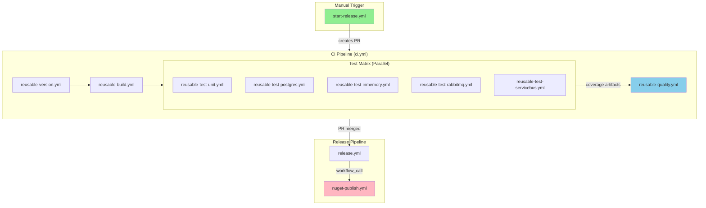
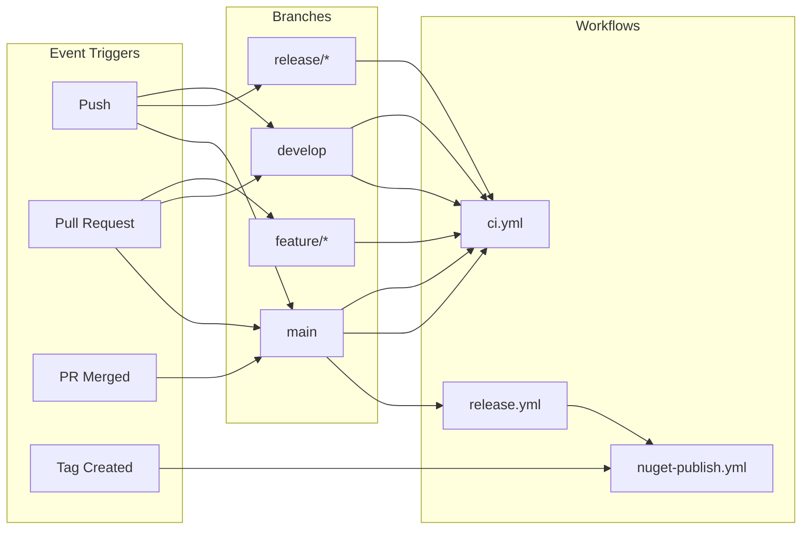
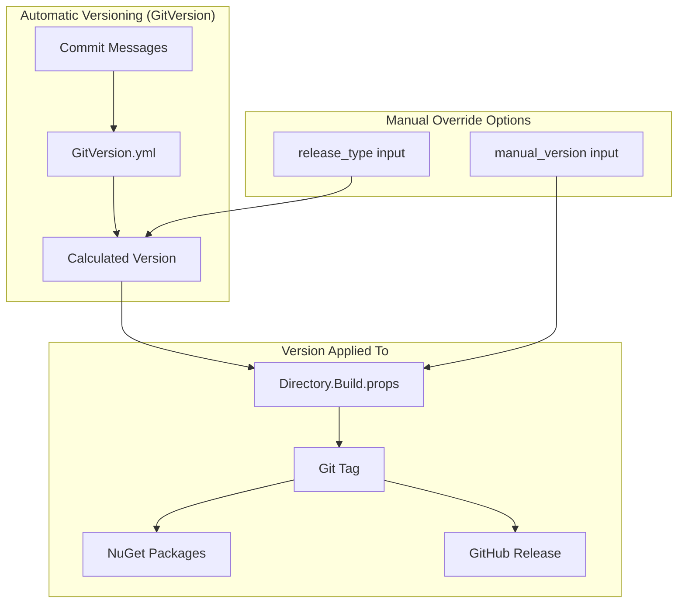
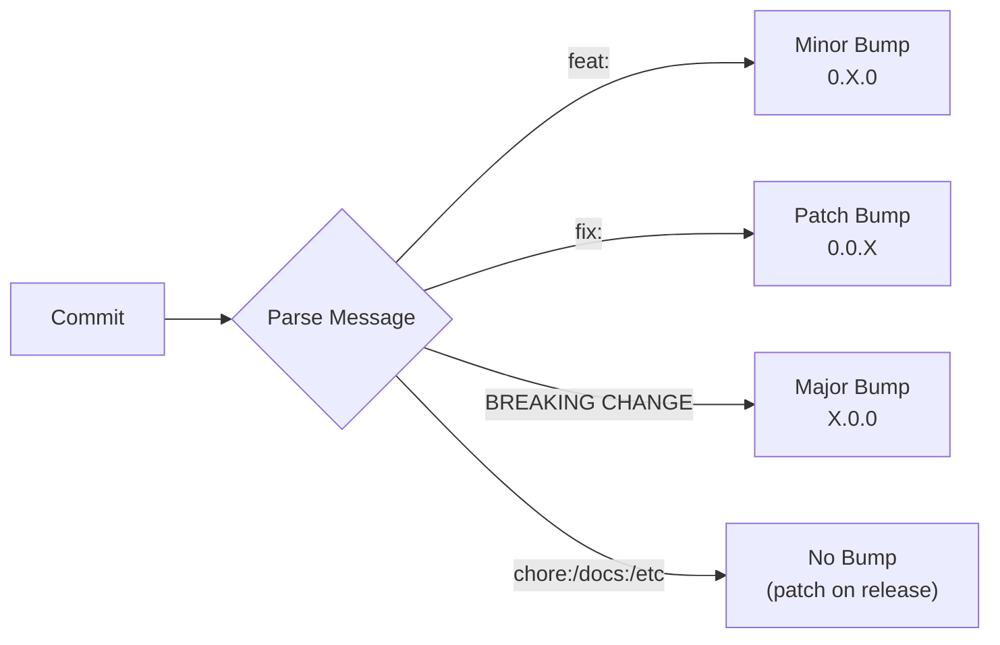
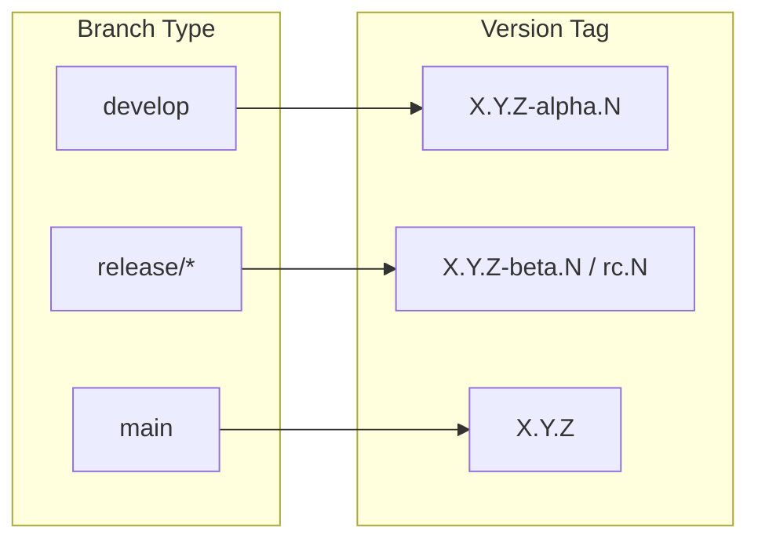
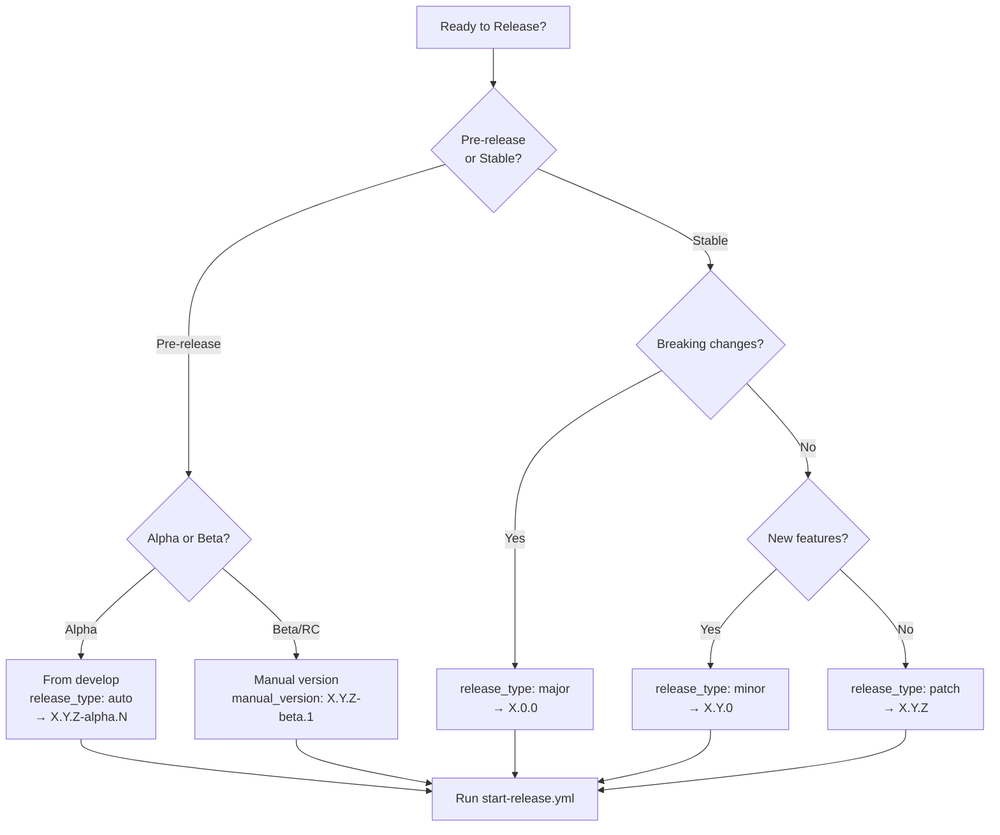
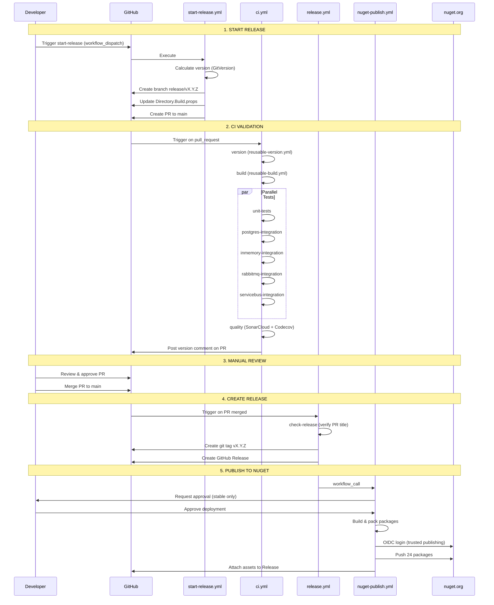
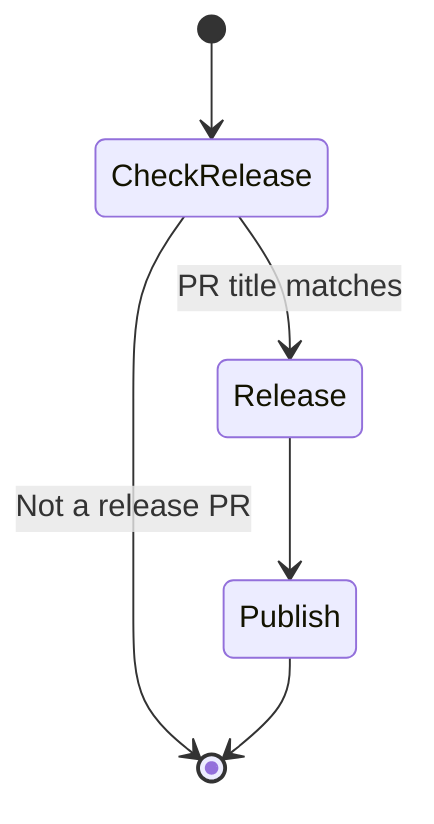
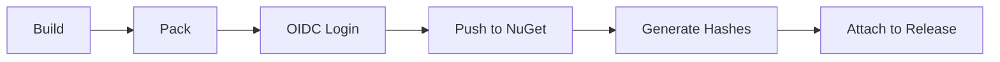
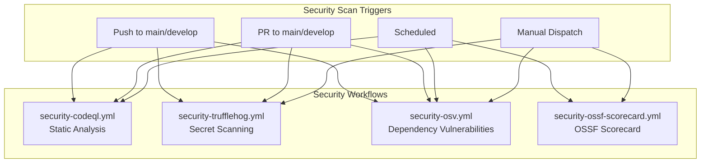

# Whizbang CI/CD Pipeline Documentation

This document provides comprehensive documentation for the Whizbang CI/CD pipeline, including workflow structure, versioning guide, and release process.

## Table of Contents

- [Overview](#overview)
- [Directory Structure](#directory-structure)
- [Branch Workflow Matrix](#branch-workflow-matrix)
- [Versioning Guide](#versioning-guide)
- [Release Process](#release-process)
- [Workflow Reference](#workflow-reference)
- [Security Workflows](#security-workflows)
- [Troubleshooting](#troubleshooting)

---

## Overview

The Whizbang CI/CD pipeline follows GitFlow branching strategy with semantic versioning (SemVer). Key features:

- **Automated versioning** via GitVersion based on commit messages
- **5 parallel test suites** with coverage collection
- **OIDC trusted publishing** to NuGet (no secrets in workflows)
- **Separate environments** for stable vs pre-release packages
- **Defensive fallbacks** for resilient builds



---

## Directory Structure

```
.github/
├── actions/                                    # Composite Actions (reusable logic)
│   ├── setup-dotnet/action.yml                 # .NET SDK setup with caching
│   ├── gitversion/action.yml                   # Version calculation with fallback
│   ├── coverage-merge/action.yml               # Test coverage aggregation
│   ├── nuget-pack/action.yml                   # NuGet package creation
│   └── nuget-publish/action.yml                # OIDC publishing to nuget.org
│
├── workflows/                                  # Workflows (event handlers)
│   │
│   │   # Core Pipelines
│   ├── ci.yml                                  # Main CI orchestrator
│   ├── release.yml                             # Release automation
│   ├── start-release.yml                       # Release initiation
│   │
│   │   # NuGet
│   ├── nuget-validate.yml                      # PR package validation
│   ├── nuget-publish.yml                       # NuGet publishing
│   │
│   │   # Reusable Workflows
│   ├── reusable-version.yml                    # Version calculation
│   ├── reusable-build.yml                      # Solution build
│   ├── reusable-quality.yml                    # SonarCloud + Codecov
│   ├── reusable-test-unit.yml                  # Unit tests
│   ├── reusable-test-postgres.yml              # PostgreSQL tests
│   ├── reusable-test-inmemory.yml              # In-memory tests
│   ├── reusable-test-rabbitmq.yml              # RabbitMQ tests
│   ├── reusable-test-servicebus.yml            # Service Bus tests
│   │
│   │   # Security
│   ├── security-codeql.yml                     # Static analysis
│   ├── security-trufflehog.yml                 # Secret scanning
│   ├── security-osv.yml                        # Dependency vulnerabilities
│   ├── security-ossf-scorecard.yml             # OSSF Scorecard
│   │
│   │   # Maintenance
│   └── maintenance-cache-cleanup.yml           # Weekly cache cleanup
│
└── WORKFLOWS.md                                # This documentation
```

---

## Branch Workflow Matrix

| Branch | On Push | On PR | On Merge | On Tag |
|--------|---------|-------|----------|--------|
| `feature/*` | - | CI (full) | - | - |
| `develop` | CI (full) | CI (full) | - | - |
| `release/*` | CI (full) | - | - | - |
| `main` | CI (full) | CI (full) | Release | - |
| `v*` tags | - | - | - | NuGet Publish |

**Legend:**
- **CI (full)** = version → build → tests (5) → quality → version-comment
- **Release** = check-release → create-tag → github-release → nuget-publish
- **NuGet Publish** = build → pack → OIDC login → push to nuget.org



---

## Versioning Guide

### How Versioning Works



### Version Sources & Priority

| Source | Priority | Used When | Example |
|--------|----------|-----------|---------|
| Manual version input | 1 (highest) | User specifies exact version | `1.2.3-beta.1` |
| Release type override | 2 | User forces bump type | `major` → `2.0.0` |
| GitVersion (auto) | 3 (default) | Normal releases | Calculated from commits |
| Branch name fallback | 4 (fallback) | GitVersion fails | Extract from `release/v1.2.3` |

### SemVer Calculation Rules



| Commit Prefix | Version Impact | Example |
|---------------|----------------|---------|
| `feat:` | Minor bump (+0.1.0) | `feat: add dark mode` → 0.9.0 → 0.10.0 |
| `fix:` | Patch bump (+0.0.1) | `fix: null check` → 0.9.0 → 0.9.1 |
| `BREAKING CHANGE:` | Major bump (+1.0.0) | Footer in commit → 0.9.0 → 1.0.0 |
| `chore:`, `docs:`, etc | No bump (patch on release) | - |

### Pre-release Tags by Branch



| Branch | Pre-release Tag | Example | NuGet Listing |
|--------|----------------|---------|---------------|
| `develop` | `-alpha.N` | `0.9.1-alpha.5` | Pre-release only |
| `release/*` | none (or `-beta.N`) | `0.9.1` or `0.9.1-beta.1` | Pre-release only |
| `main` | none | `0.9.1` | Stable release |

### Manual Versioning Options

#### Option 1: Auto (Default)
Use GitVersion calculation based on commits since last release.

```bash
# In start-release.yml workflow_dispatch:
release_type: auto  # Default
```

#### Option 2: Force Bump Type
Override the increment type regardless of commit messages.

```bash
# Force a major version bump
release_type: major  # 0.9.1 → 1.0.0

# Force a minor version bump
release_type: minor  # 0.9.1 → 0.10.0

# Force a patch version bump
release_type: patch  # 0.9.1 → 0.9.2
```

#### Option 3: Exact Version
Specify the exact version string (bypasses all calculation).

```bash
# Specify exact version
release_type: manual
manual_version: 1.2.3-beta.1  # Used as-is
```

### Version Storage Locations

| Location | Purpose | Example |
|----------|---------|---------|
| `Directory.Build.props` | Source of truth for builds | `<Version>0.9.1</Version>` |
| Git tag | Release marker | `v0.9.1` |
| GitHub Release | Distribution notes | `Release v0.9.1` |
| NuGet package | Published artifact | `SoftwareExtravaganza.Whizbang.Core.0.9.1.nupkg` |
| PR title | Release trigger | `chore(release): v0.9.1` |

---

## Release Process

### Release Decision Tree



### How Branch Names Affect Versioning

**Branch names matter!** GitVersion uses the branch name to determine the pre-release suffix:

| Branch Pattern | Regex in GitVersion.yml | Auto-Applied Suffix | Example Output |
|----------------|------------------------|---------------------|----------------|
| `develop` | `^develop$` | `-alpha.N` | `0.9.2-alpha.5` |
| `release/*` or `releases/*` | `^releases?[/-]` | *(none)* | `0.9.2` |
| `main` or `master` | `^master$\|^main$` | *(none)* | `0.9.2` |
| Pull Request | `[/-](?<number>\d+)` | `-pr.N` | `0.9.2-pr.123` |
| Feature branches | *(other)* | `-branch.N` | `0.9.2-feature-foo.1` |

**Key Insight**: To get an `-alpha` release, you **must** run `start-release.yml` while on the `develop` branch. The branch determines the suffix, not your input.

For **beta** or **rc** releases, use `release_type: manual` with `manual_version: X.Y.Z-beta.1` since those aren't auto-generated from branch names.

> **Note**: The version number in `release/vX.Y.Z` branch names is purely organizational. The actual version is calculated by GitVersion and stored in `Directory.Build.props`, not extracted from the branch name. You could name the branch `release/banana` and it would still work - the wildcard part is just for human readability.

---

### Release Prerequisites by Type

Before starting a release, ensure you meet these prerequisites.

> **Note**: You do NOT manually create tags. The workflow automatically:
> 1. Calculates the version
> 2. Creates the release branch
> 3. Updates `Directory.Build.props`
> 4. Creates the PR
> 5. After merge → creates the git tag automatically

| Release Type | Start From Branch | Auto-Generated Tag | Approval Required | Workflow to Run | Notes |
|--------------|-------------------|-------------------|-------------------|-----------------|-------|
| **Alpha** | `develop` | `vX.Y.Z-alpha.N` | No | `start-release.yml` | For testing new features |
| **Beta** | `develop` or `release/*` | `vX.Y.Z-beta.N` | No | `start-release.yml` | Feature-complete, testing phase |
| **Release Candidate** | `release/*` | `vX.Y.Z-rc.N` | No | `start-release.yml` | Final testing before stable |
| **Stable (Patch)** | `main` or `release/*` | `vX.Y.Z` | **Yes** | `start-release.yml` | Bug fixes only |
| **Stable (Minor)** | `main` or `release/*` | `vX.Y.0` | **Yes** | `start-release.yml` | New features, backward compatible |
| **Stable (Major)** | `main` or `release/*` | `vX.0.0` | **Yes** | `start-release.yml` | Breaking changes |
| **Hotfix** | `main` | `vX.Y.Z` | **Yes** | `start-release.yml` | Urgent production fix |

### Release Type Details

#### Alpha Release
| Requirement | Value |
|-------------|-------|
| **Source Branch** | `develop` |
| **Workflow** | `start-release.yml` |
| **Workflow Input** | `release_type: auto` |
| **Resulting Tag** | `vX.Y.Z-alpha.N` (auto-incremented) |
| **NuGet Listing** | Pre-release only |
| **Approval** | None (auto-approved) |
| **Use Case** | Early testing of new features |

#### Beta Release
| Requirement | Value |
|-------------|-------|
| **Source Branch** | `develop` or existing `release/*` |
| **Workflow** | `start-release.yml` |
| **Workflow Input** | `release_type: manual`, `manual_version: X.Y.Z-beta.1` |
| **Resulting Tag** | `vX.Y.Z-beta.N` |
| **NuGet Listing** | Pre-release only |
| **Approval** | None (auto-approved) |
| **Use Case** | Feature-complete, broader testing |

#### Release Candidate (RC)
| Requirement | Value |
|-------------|-------|
| **Source Branch** | `release/*` branch |
| **Workflow** | `start-release.yml` |
| **Workflow Input** | `release_type: manual`, `manual_version: X.Y.Z-rc.1` |
| **Resulting Tag** | `vX.Y.Z-rc.N` |
| **NuGet Listing** | Pre-release only |
| **Approval** | None (auto-approved) |
| **Use Case** | Final validation before stable |

#### Stable Release (Patch/Minor/Major)
| Requirement | Value |
|-------------|-------|
| **Source Branch** | `main` or `release/*` |
| **Workflow** | `start-release.yml` |
| **Workflow Input** | `release_type: patch/minor/major` or `auto` |
| **Resulting Tag** | `vX.Y.Z` (no pre-release suffix) |
| **NuGet Listing** | Stable (visible by default) |
| **Approval** | **Required** (nuget-publish environment) |
| **Use Case** | Production-ready release |

#### Hotfix
| Requirement | Value |
|-------------|-------|
| **Source Branch** | `main` (create hotfix branch from main) |
| **Workflow** | `start-release.yml` |
| **Workflow Input** | `release_type: patch` |
| **Resulting Tag** | `vX.Y.Z` |
| **NuGet Listing** | Stable |
| **Approval** | **Required** |
| **Use Case** | Urgent fix for production issue |

### Common Versioning Scenarios

| Scenario | Workflow Input | Resulting Version |
|----------|----------------|-------------------|
| Regular alpha from develop | `release_type: auto` | `0.9.2-alpha.1` |
| Promote alpha to stable | `release_type: auto` (from main) | `0.9.2` |
| Hotfix for production | `release_type: patch` | `0.9.2` |
| New feature release | `release_type: minor` | `0.10.0` |
| Breaking change release | `release_type: major` | `1.0.0` |
| Specific pre-release | `manual_version: 1.0.0-rc.1` | `1.0.0-rc.1` |

### Release Flow (Step by Step)



### Step-by-Step Release Instructions

#### 1. Initiate Release

1. Go to **Actions** → **Start Release** → **Run workflow**
2. Select `release_type`:
   - `auto` - Let GitVersion calculate version
   - `major` / `minor` / `patch` - Force specific bump
   - `manual` - Specify exact version in `manual_version`
3. Click **Run workflow**

#### 2. Wait for CI

The workflow will:
- Create branch `release/vX.Y.Z`
- Update `Directory.Build.props` with the version
- Create a PR to `main`
- CI runs automatically on the PR

#### 3. Review and Approve

1. Review the PR (version number, CI status)
2. Approve the PR
3. **Squash and merge** to `main`

#### 4. Approve NuGet Publish

1. After merge, `release.yml` creates the tag and GitHub Release
2. For **stable releases**: Approve the `nuget-publish` environment deployment
3. For **pre-releases**: Automatically approved (no manual step)

#### 5. Verify

- Check [NuGet.org](https://www.nuget.org/profiles/SoftwareExtravaganza) for new packages
- Check GitHub Releases for attached assets

---

## Workflow Reference

### Core Pipelines

#### ci.yml - Continuous Integration

**Purpose**: Main CI orchestrator that validates all code changes.

**Triggers**: `push` (main, develop, release/*), `pull_request` (main, develop)

**Jobs**:
| Job | Description | Duration |
|-----|-------------|----------|
| `version` | Calculate semantic version | ~1 min |
| `build` | Compile solution | ~10 min |
| `unit-tests` | Run unit tests | ~6 min |
| `postgres-integration` | PostgreSQL integration tests | ~6 min |
| `inmemory-integration` | In-memory integration tests | ~7 min |
| `rabbitmq-integration` | RabbitMQ integration tests | ~9 min |
| `servicebus-integration` | Azure Service Bus tests | ~8 min |
| `quality` | SonarCloud + Codecov analysis | ~12 min |
| `version-comment` | Post version to PR | ~1 min |

**Total Duration**: ~40-60 minutes (tests run in parallel)

#### release.yml - Release Automation

**Purpose**: Create GitHub releases when release PRs are merged.

**Triggers**: `pull_request.closed` (merged to main)

**Conditions**: PR title must match `chore(release): vX.Y.Z`



#### start-release.yml - Release Initiation

**Purpose**: Create release branch and PR for a new version.

**Triggers**: `workflow_dispatch` (manual)

**Inputs**:
| Input | Type | Description |
|-------|------|-------------|
| `release_type` | choice | auto, major, minor, patch, manual |
| `manual_version` | string | Version when release_type=manual |

### NuGet Workflows

#### nuget-validate.yml

**Purpose**: Validate that NuGet packages can be built during PR review.

**Triggers**: `pull_request`

#### nuget-publish.yml

**Purpose**: Publish packages to nuget.org using OIDC trusted publishing.

**Triggers**: `workflow_call` (from release.yml)

**Environment**: `nuget-publish` (stable) or `nuget-publish-prerelease` (pre-release)



### Reusable Workflows

| Workflow | Purpose | Outputs |
|----------|---------|---------|
| `reusable-version.yml` | Calculate semantic version | `semver`, `major`, `minor`, `patch`, `prerelease` |
| `reusable-build.yml` | Compile solution | Build artifacts |
| `reusable-quality.yml` | SonarCloud + Codecov | Quality analysis |
| `reusable-test-unit.yml` | Unit tests | Test results, coverage |
| `reusable-test-postgres.yml` | PostgreSQL tests | Test results, coverage |
| `reusable-test-inmemory.yml` | In-memory tests | Test results, coverage |
| `reusable-test-rabbitmq.yml` | RabbitMQ tests | Test results, coverage |
| `reusable-test-servicebus.yml` | Service Bus tests | Test results, coverage |

---

## Security Workflows

| Workflow | Tool | Purpose | Schedule |
|----------|------|---------|----------|
| `security-codeql.yml` | CodeQL | Static analysis for security vulnerabilities | Sun 0:00 |
| `security-trufflehog.yml` | TruffleHog | Secret/credential scanning | On push/PR |
| `security-osv.yml` | OSV Scanner | Dependency vulnerability detection | Tue 8:00 |
| `security-ossf-scorecard.yml` | OSSF Scorecard | Supply chain security scoring | Sun 0:00 |



---

## Troubleshooting

### GitVersion Outputs "undefined"

**Error**: `Error: GitVersion output is not valid JSON`

**Cause**: GitVersion can fail on certain branch/tag states.

**Solution**: The workflow has a fallback that extracts version from branch name or PR title.

### "Cannot upload assets to an immutable release"

**Error**: `nuget-publish.yml` fails when trying to create a release that already exists.

**Cause**: `release.yml` already created the GitHub Release.

**Solution**: `nuget-publish.yml` now only uploads assets to the existing release.

### Environment Approval Required

**Issue**: Release is waiting for approval.

**For stable releases**: This is expected - approve in the GitHub Actions UI.

**For pre-releases**: Should auto-approve. Check that the `nuget-publish-prerelease` environment exists.

### SonarCloud CPD Duplication

**Issue**: High duplication percentage reported.

**Note**: Some files are intentionally excluded from CPD analysis:
- `**/EFCorePostgresLensQuery.cs` - Generic T1-T10 variants (base class pattern)
- `**/*.sql` - SQL migrations share boilerplate by design
- Generators - Code generation templates have intentional repetition

---

## Configuration Files

| File | Purpose |
|------|---------|
| `GitVersion.yml` | SemVer calculation rules |
| `Directory.Build.props` | Version and package metadata |
| `scripts/Run-Tests.ps1` | Test runner script |

## GitHub Settings

| Setting | Location | Purpose |
|---------|----------|---------|
| `nuget-publish` environment | Settings → Environments | Approval gate for stable releases |
| `nuget-publish-prerelease` environment | Settings → Environments | Auto-approve for pre-releases |
| `SONAR_TOKEN` secret | Settings → Secrets | SonarCloud authentication |
| `CODECOV_TOKEN` secret | Settings → Secrets | Codecov authentication |

---

*Last updated: Generated from CI/CD optimization plan*
