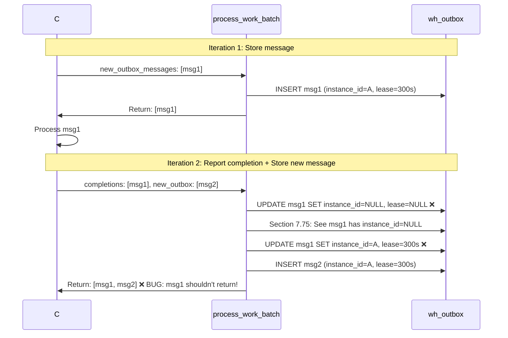
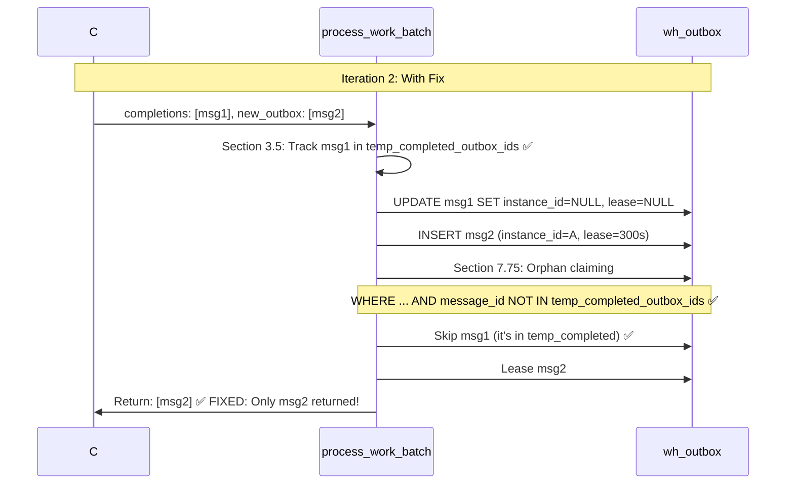

# Process Work Batch Function - Flow Analysis

## Overview
The `process_work_batch` PostgreSQL function is the heart of Whizbang's work coordination system. It performs all coordination operations in a single atomic transaction.

## Function Signature
```sql
CREATE OR REPLACE FUNCTION process_work_batch(
  -- Instance identification
  p_instance_id UUID,
  p_service_name VARCHAR(200),
  p_host_name VARCHAR(200),
  p_process_id INTEGER,
  p_metadata JSONB DEFAULT NULL,

  -- Completion tracking
  p_outbox_completions JSONB DEFAULT '[]'::JSONB,
  p_outbox_failures JSONB DEFAULT '[]'::JSONB,
  p_inbox_completions JSONB DEFAULT '[]'::JSONB,
  p_inbox_failures JSONB DEFAULT '[]'::JSONB,

  -- Immediate processing
  p_new_outbox_messages JSONB DEFAULT '[]'::JSONB,
  p_new_inbox_messages JSONB DEFAULT '[]'::JSONB,

  -- Configuration
  p_lease_seconds INTEGER DEFAULT 300,
  p_stale_threshold_seconds INTEGER DEFAULT 600,
  p_flags INTEGER DEFAULT 0,
  p_partition_count INTEGER DEFAULT 10000,
  p_max_partitions_per_instance INTEGER DEFAULT NULL
)
RETURNS TABLE(...work batch records...)
```

## Execution Flow

```mermaid
flowchart TD
    Start([Function Called]) --> S1[Section 1: Register/Update Instance]

    S1 --> S2[Section 2: Clean Up Stale Instances]
    S2 --> S2_5[Section 2.5: Calculate Fair Partition Share]

    S2_5 --> S3[Section 3: Heartbeat Owned Partitions]
    S3 --> S3_5[Section 3.5: Track Completed Message IDs]

    S3_5 --> |Create temp tables| T1[temp_completed_outbox_ids<br/>temp_completed_inbox_ids]
    T1 --> |Extract IDs from arrays| S4[Section 4-5: Process Completions & Failures]

    S4 --> |Clear leases| ClearLease[Set instance_id = NULL<br/>Set lease_expiry = NULL]
    ClearLease --> |Delete or Update| S6[Section 6: Store New Outbox Messages]

    S6 --> |Create temp table| T2[temp_new_outbox_ids]
    T2 --> |Compute partitions| S7[Section 7: Store New Inbox Messages]

    S7 --> |Create temp table| T3[temp_new_inbox_ids]
    T3 --> |Deduplication| S7_25[Section 7.25: Claim Partitions for New Messages]

    S7_25 --> S7_4[Section 7.4: Claim Partitions for Orphaned Messages]
    S7_4 --> |Consistent hashing| S7_5[Section 7.5: Event Store Integration]

    S7_5 --> |Persist events| S7_75[Section 7.75: Claim Orphaned Messages in Owned Partitions]

    S7_75 --> |Create temp tables| T4[temp_orphaned_outbox_ids<br/>temp_orphaned_inbox_ids]
    T4 --> |BUG: Should exclude completed IDs| OrphanCheck{Message orphaned?}

    OrphanCheck --> |Yes, and NOT completed| Lease[Lease to p_instance_id]
    OrphanCheck --> |No or completed| Skip[Skip]

    Lease --> S8[Section 8: Return Work]
    Skip --> S8

    S8 --> |Filter| ReturnFilter{Message in temp_new_*<br/>OR temp_orphaned_*?}
    ReturnFilter --> |Yes| Return[Return as work]
    ReturnFilter --> |No| Exclude[Exclude from results]

    Return --> End([End Transaction])
    Exclude --> End

    style T1 fill:#ffcccc
    style T2 fill:#ccffcc
    style T3 fill:#ccffcc
    style T4 fill:#ffcccc
    style ClearLease fill:#ffeeaa
    style OrphanCheck fill:#ffaaaa
```



## Detailed Section Breakdown

### Section 1-2.5: Instance Management
**Purpose:** Register this instance, clean up dead instances, calculate partition allocation

**Operations:**
1. `INSERT ... ON CONFLICT` to register/update instance with heartbeat
2. `DELETE` stale instances (last_heartbeat_at < cutoff)
3. Calculate `v_dynamic_max_partitions` based on active instance count

**Key Variables:**
- `v_now` - Current timestamp
- `v_lease_expiry` - When leases expire (v_now + lease_seconds)
- `v_stale_cutoff` - When instances are considered stale (v_now - stale_threshold)
- `v_dynamic_max_partitions` - Max partitions this instance can own

---

### Section 3: Heartbeat Owned Partitions
**Purpose:** Update heartbeat on partitions already owned by this instance

**SQL:**
```sql
UPDATE wh_partition_assignments
SET last_heartbeat = v_now
WHERE instance_id = p_instance_id;
```

---

### Section 3.5: Track Completed Message IDs ⚠️ NEW!
**Purpose:** **CRITICAL FIX** - Track which messages are being completed in THIS call so we can exclude them from orphan claiming

**Problem Being Solved:**
1. Section 4 clears leases on completed messages (instance_id = NULL)
2. Section 7.75 sees NULL instance_id and reclaims as orphaned
3. Result: Completed messages returned as work again!

**Operations:**
```sql
CREATE TEMP TABLE temp_completed_outbox_ids (message_id UUID PRIMARY KEY);
CREATE TEMP TABLE temp_completed_inbox_ids (message_id UUID PRIMARY KEY);

INSERT INTO temp_completed_outbox_ids
  SELECT messageId FROM p_outbox_completions
  UNION SELECT messageId FROM p_outbox_failures;

INSERT INTO temp_completed_inbox_ids
  SELECT messageId FROM p_inbox_completions
  UNION SELECT messageId FROM p_inbox_failures;
```

**Temp Tables Created:**
- `temp_completed_outbox_ids` - Messages being completed this call
- `temp_completed_inbox_ids` - Messages being completed this call

---

### Section 4-5: Process Completions & Failures
**Purpose:** Mark messages as completed or failed, clear their leases

**Operations:**
1. **Completions:** Update status flags (bitwise OR), set processed_at/published_at, **clear lease**
2. **Fully Completed:** Delete if `(status & 24) = 24` (both ReceptorProcessed AND PerspectiveProcessed)
3. **Failures:** Set Failed flag (bit 15), increment attempts, **clear lease**

**Critical Detail:**
```sql
UPDATE wh_outbox
SET status = status | v_completion.status_flags,
    instance_id = NULL,        -- ⚠️ CLEARS LEASE!
    lease_expiry = NULL,       -- ⚠️ CLEARS LEASE!
    processed_at = v_now
WHERE message_id = v_completion.msg_id;
```

This is why we need section 3.5 - these messages now look "orphaned" but shouldn't be reclaimed!

---

### Section 6-7: Store New Messages
**Purpose:** Store new outbox/inbox messages with immediate lease to this instance

**Outbox (Section 6):**
```sql
CREATE TEMP TABLE temp_new_outbox_ids (message_id UUID PRIMARY KEY);

FOR v_new_msg IN SELECT ... FROM p_new_outbox_messages LOOP
  v_partition := compute_partition(stream_id, p_partition_count);

  INSERT INTO wh_outbox (..., instance_id, lease_expiry)
  VALUES (..., p_instance_id, v_lease_expiry);

  INSERT INTO temp_new_outbox_ids VALUES (message_id);
END LOOP;
```

**Inbox (Section 7):**
```sql
CREATE TEMP TABLE temp_new_inbox_ids (message_id UUID PRIMARY KEY);

-- Deduplication check
WITH new_msgs AS (
  INSERT INTO wh_message_deduplication (message_id, first_seen_at)
  SELECT messageId, v_now FROM p_new_inbox_messages
  ON CONFLICT DO NOTHING
  RETURNING message_id
)
INSERT INTO temp_new_inbox_ids SELECT message_id FROM new_msgs;

-- Only insert truly new messages
FOR v_new_msg IN SELECT ... WHERE message_id IN temp_new_inbox_ids LOOP
  INSERT INTO wh_inbox (..., instance_id, lease_expiry)
  VALUES (..., p_instance_id, v_lease_expiry);
END LOOP;
```

**Temp Tables Created:**
- `temp_new_outbox_ids` - Newly stored outbox messages
- `temp_new_inbox_ids` - Newly stored inbox messages (after deduplication)

---

### Section 7.25: Claim Partitions for New Messages
**Purpose:** Ensure this instance owns the partitions where it just stored messages

**SQL:**
```sql
INSERT INTO wh_partition_assignments (partition_number, instance_id, ...)
SELECT DISTINCT partition_number, p_instance_id, v_now, v_now
FROM wh_outbox
WHERE instance_id = p_instance_id
  AND partition_number NOT IN (SELECT partition_number FROM wh_partition_assignments WHERE instance_id = p_instance_id)
LIMIT v_dynamic_max_partitions - (owned partition count)
ON CONFLICT DO NOTHING;
```

---

### Section 7.4: Claim Partitions for Orphaned Messages
**Purpose:** Load-balanced partition claiming for orphaned work using consistent hashing

**SQL:**
```sql
WITH orphaned_partitions AS (
  SELECT DISTINCT partition_number
  FROM wh_outbox
  WHERE (instance_id IS NULL OR lease_expiry < v_now)
    AND not failed AND not completed
  UNION
  SELECT DISTINCT partition_number FROM wh_inbox WHERE ...
),
partitions_to_claim AS (
  SELECT partition_number, ROW_NUMBER() OVER (ORDER BY hashtext(...))
  FROM orphaned_partitions
  WHERE partition unassigned OR stale
  LIMIT v_dynamic_max_partitions - (owned count)
)
INSERT INTO wh_partition_assignments ...
```

---

### Section 7.5: Event Store Integration
**Purpose:** Persist events to event store with stream-based versioning

**SQL:**
```sql
WITH outbox_events AS (
  SELECT stream_id, ROW_NUMBER() OVER (PARTITION BY stream_id ORDER BY message_id)
  FROM p_new_outbox_messages
  WHERE isEvent = true
)
INSERT INTO wh_event_store (event_id, stream_id, version, ...)
SELECT ..., base_version + row_num AS version
FROM outbox_events
ON CONFLICT (stream_id, version) DO NOTHING;  -- Optimistic concurrency
```

---

### Section 7.75: Claim Orphaned Messages in Owned Partitions ⚠️ BUG HERE!
**Purpose:** Lease all orphaned messages within partitions we own

**Current Implementation:**
```sql
CREATE TEMP TABLE temp_orphaned_outbox_ids (message_id UUID PRIMARY KEY);

WITH orphaned AS (
  UPDATE wh_outbox
  SET instance_id = p_instance_id,
      lease_expiry = v_lease_expiry
  WHERE partition_number IN (owned partitions)
    AND (instance_id IS NULL OR lease_expiry < v_now)  -- ⚠️ BUG: Includes just-completed messages!
    AND not failed
    AND not completed
  RETURNING message_id
)
INSERT INTO temp_orphaned_outbox_ids SELECT message_id FROM orphaned;
```

**THE BUG:**
- Messages completed in section 4-5 have `instance_id = NULL`
- This WHERE clause: `instance_id IS NULL` matches them!
- Result: Just-completed messages get re-leased and returned as work

**THE FIX:**
```sql
WHERE partition_number IN (owned partitions)
  AND (instance_id IS NULL OR lease_expiry < v_now)
  AND (status & 32768) = 0
  AND (status & 24) != 24
  AND message_id NOT IN (SELECT message_id FROM temp_completed_outbox_ids)  -- ✅ EXCLUDE JUST COMPLETED!
```

**Temp Tables Created:**
- `temp_orphaned_outbox_ids` - Messages re-leased as orphaned
- `temp_orphaned_inbox_ids` - Messages re-leased as orphaned

---

### Section 8: Return Work
**Purpose:** Return only new or orphaned messages from owned partitions

**SQL:**
```sql
RETURN QUERY
SELECT ...
FROM wh_outbox o
WHERE o.instance_id = p_instance_id
  AND o.lease_expiry > v_now
  AND not failed
  AND not completed
  AND (o.message_id IN temp_new_outbox_ids OR o.message_id IN temp_orphaned_outbox_ids)  -- Only new or orphaned
ORDER BY stream_id, created_at;  -- Stream ordering!
```

**Key Filter:**
- Must be leased to this instance
- Must have valid (non-expired) lease
- Must be either:
  - Newly stored this call (in `temp_new_outbox_ids`), OR
  - Orphaned and re-leased this call (in `temp_orphaned_outbox_ids`)

This prevents returning messages that already had valid leases before this call.

---

## The Bug & The Fix

### The Bug Flow


### The Fix Flow


---

## Call Patterns

### Background Worker Pattern
```
Every 1 second:
  do {
    workBatch = ProcessWorkBatch(completions, failures, new=[], ...)
    Process workBatch.OutboxWork -> add to completions/failures
    Process workBatch.InboxWork -> add to completions/failures
  } while (completions.Count > 0 || failures.Count > 0)
```

### Dispatcher Pattern
```
When HTTP request stores message:
  ProcessWorkBatch(completions=[], failures=[], new_outbox=[msg], ...)
  Returns: [msg] with valid lease
  Continue processing...
```

---

## Performance Characteristics

### Temp Table Creation (Current)
- **Count:** 6 temp tables per call
- **Frequency:** ~100+ calls/second under load
- **Overhead:** Microseconds per temp table (catalog updates, memory allocation)
- **Recommendation:** Monitor in production, consider array-based refactor if needed

### Alternative: Array-Based Tracking
```sql
DECLARE
  v_completed_outbox_ids UUID[];

v_completed_outbox_ids := ARRAY(
  SELECT (elem->>'messageId')::UUID
  FROM jsonb_array_elements(p_outbox_completions)
  UNION
  SELECT (elem->>'messageId')::UUID
  FROM jsonb_array_elements(p_outbox_failures)
);

-- Later in section 7.75:
WHERE ...
  AND message_id != ALL(v_completed_outbox_ids)
```

**Pros:** More efficient (no catalog overhead)
**Cons:** Slightly different syntax for NOT IN checks

---

## Summary

The `process_work_batch` function is a sophisticated work coordination system that:
1. ✅ Manages instance lifecycle and partition distribution
2. ✅ Processes completions/failures atomically
3. ✅ Stores new messages with immediate leasing
4. ✅ Claims orphaned work with load balancing
5. ✅ Integrates with event store
6. ⚠️ **HAS BUG:** Re-leases just-completed messages in section 7.75
7. ✅ **FIX:** Track completed IDs in section 3.5, exclude in section 7.75

The temp table approach works but could be optimized to arrays in the future.
