<p align="center">
  
</p>

<p align="center">
  <a href="https://whizba.ng/">Documentation</a> &middot;
  <a href="https://www.nuget.org/packages/Whizbang.Core/">NuGet</a> &middot;
  <a href="CONTRIBUTING.md">Contributing</a>
</p>

<p align="center">
  <a href="https://github.com/whizbang-lib/whizbang/actions/workflows/ci.yml"></a>
  <a href="https://codecov.io/gh/whizbang-lib/whizbang"></a>
  <a href="https://sonarcloud.io/dashboard?id=whizbang-lib_whizbang"></a>
  <a href="https://www.nuget.org/packages/Whizbang.Core/"></a>
  <a href="https://opensource.org/licenses/MIT"></a>
</p>

<p align="center">
  <a href="https://github.com/whizbang-lib/whizbang/actions/workflows/security-secrets.yml"></a>
  <a href="https://github.com/whizbang-lib/whizbang/actions/workflows/security-supply-chain.yml"></a>
  <a href="https://securityscorecards.dev/viewer/?uri=github.com/whizbang-lib/whizbang"></a>
</p>

<p align="center">
  <a href="https://codecov.io/gh/whizbang-lib/whizbang"></a>
</p>

---

<h3 align="center"><a href="https://whizba.ng">Read the full documentation at whizba.ng</a></h3>

---

## Why Whizbang?

- **Blazing Performance** — < 20ns in-process message dispatch with zero allocations on the hot path
- **Native AOT from Day One** — Source generators wire everything at compile time; no reflection, no runtime surprises
- **Type Safe** — Compile-time verification of message handlers, routing, and event schemas
- **Developer Experience** — Rich IDE support with code navigation, diagnostics, and discovery via source generators

## Core Concepts

**Receptors** — Stateless message handlers that receive commands and produce events. Type-safe with flexible response types.

**Dispatcher** — Message routing engine that connects messages to receptors with full observability (correlation, causation, hops).

**Perspectives** — Materialized read models built from event streams. Individually hash-tracked for incremental migration.

**Lenses** — Composable query projections over perspective data with LINQ translation to SQL.

**Event Store** — Append-only event storage with stream-based organization, UUIDv7 ordering, and optimistic concurrency.

**Policy Engine** — Declarative rules for message validation, transformation, and routing decisions.

## Project Structure

```
src/
├── Whizbang.Core/                          # Core interfaces, messaging, perspectives, lenses
├── Whizbang.Generators/                    # Roslyn source generators (receptors, perspectives, registry)
├── Whizbang.Data.Dapper.Postgres/          # Dapper + PostgreSQL stores (event store, work coordinator)
├── Whizbang.Data.EFCore.Postgres/          # EF Core + PostgreSQL stores with turnkey initialization
├── Whizbang.Data.EFCore.Postgres.Generators/  # EF Core source generators (schema, registration)
├── Whizbang.Transports.RabbitMQ/           # RabbitMQ transport
├── Whizbang.Transports.AzureServiceBus/    # Azure Service Bus transport
├── Whizbang.Transports.HotChocolate/       # GraphQL integration via HotChocolate
├── Whizbang.Transports.FastEndpoints/      # REST integration via FastEndpoints
├── Whizbang.SignalR/                       # Real-time push via SignalR
├── Whizbang.Observability/                 # Metrics and tracing
├── Whizbang.Testing/                       # Test utilities and fakes
└── Whizbang.Hosting.*/                     # Hosted service wiring for transports
```

## Technology Stack

- **.NET 10** — Target framework
- **PostgreSQL** — Primary database with JSONB, UUIDv7, and hash-based schema migration
- **EF Core 10** / **Dapper** — Dual data access with source-generated models
- **Roslyn Source Generators** — Compile-time wiring for receptors, perspectives, and DI registration
- **TUnit** — Source-generated testing with Microsoft.Testing.Platform
- **Rocks** — Source-generated mocking for AOT compatibility
- **Vogen** — Source-generated value objects

## Getting Started

```bash
dotnet add package SoftwareExtravaganza.Whizbang.Core
```

See the [Quick Start guide](https://whizba.ng/docs/getting-started/quick-start) for a walkthrough.

## Philosophy

- **Zero Reflection** — Everything via source generators
- **AOT Compatible** — Native AOT from day one
- **Type Safe** — Compile-time safety everywhere
- **Test Driven** — 21,000+ tests with comprehensive coverage
- **Documentation First** — Docs drive implementation

## Contributing

See [CONTRIBUTING.md](CONTRIBUTING.md) for guidelines.

## License

[MIT](LICENSE)
