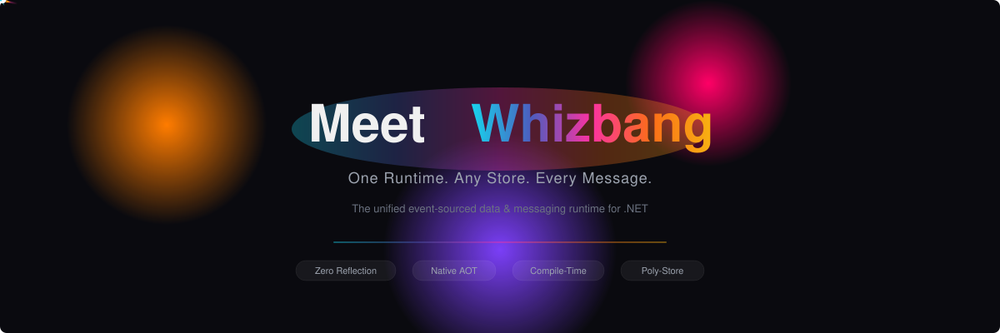

<p align="center">
  
</p>

<p align="center">
  <a href="https://whizba.ng/">Documentation</a> &middot;
  <a href="https://www.nuget.org/packages/SoftwareExtravaganza.Whizbang.Core/">NuGet</a> &middot;
  <a href="https://github.com/whizbang-lib/whizbang/releases">Releases</a> &middot;
  <a href="CONTRIBUTING.md">Contributing</a>
</p>

<p align="center">
  <a href="https://github.com/whizbang-lib/whizbang/actions/workflows/ci.yml"></a>
  <a href="https://codecov.io/gh/whizbang-lib/whizbang"></a>
  <a href="https://sonarcloud.io/dashboard?id=whizbang-lib_whizbang"></a>
  <a href="https://www.nuget.org/packages/SoftwareExtravaganza.Whizbang.Core/"></a>
  <a href="https://www.nuget.org/packages/SoftwareExtravaganza.Whizbang.Core/"></a>
  <a href="https://opensource.org/licenses/MIT"></a>
</p>

<p align="center">
  <a href="https://github.com/whizbang-lib/whizbang/actions/workflows/security-secrets.yml"></a>
  <a href="https://github.com/whizbang-lib/whizbang/actions/workflows/security-supply-chain.yml"></a>
  <a href="https://securityscorecards.dev/viewer/?uri=github.com/whizbang-lib/whizbang"></a>
  <a href="https://www.bestpractices.dev/projects/15090"></a>
</p>

<p align="center">
  <a href="https://codecov.io/gh/whizbang-lib/whizbang"></a>
</p>

---

<h3 align="center"><a href="https://whizba.ng">Read the full documentation at whizba.ng</a></h3>

---

Whizbang is a .NET library for event-driven, CQRS and event-sourced applications. Handlers, routing, read
models and storage are wired by source generators at compile time: no reflection, Native AOT from day one.

> **Status:** pre-1.0. Stable releases ship as `0.x.0` on nuget.org, with alpha builds published from
> `develop` in between. Package IDs carry the `SoftwareExtravaganza.` prefix
> (`SoftwareExtravaganza.Whizbang.Core`, and so on).

## At a glance

```csharp
// A command, and the event it produces. [StreamId] names the stream the event belongs to.
public record CreateOrder([property: StreamId] Guid OrderId, string ProductName, int Quantity) : ICommand;
public record OrderCreated([property: StreamId] Guid OrderId, string ProductName, int Quantity) : IEvent;

// A receptor: a stateless handler. The event it returns is stored and published for you.
public class CreateOrderReceptor : IReceptor<CreateOrder, OrderCreated> {
  public ValueTask<OrderCreated> HandleAsync(CreateOrder message, CancellationToken cancellationToken = default) =>
    ValueTask.FromResult(new OrderCreated(message.OrderId, message.ProductName, message.Quantity));
}

// Dispatch it, typed end to end.
var created = await dispatcher.LocalInvokeAsync<CreateOrder, OrderCreated>(
  new CreateOrder(TrackedGuid.New(), "Coffee", 2));
```

The [Quick Start](https://whizba.ng/docs/getting-started/quick-start) takes this to a running service with
PostgreSQL, a read model and a query.

## What's in the box

- **Receptors and the dispatcher:** type-safe handlers, local and remote dispatch, correlation and causation
  on every message.
- **Event store and outbox/inbox:** append-only streams with UUIDv7 ordering, exactly-once handling through
  the inbox, reliable publishing through the outbox, dead-letter recovery.
- **Perspectives and lenses:** read models built from events, queried through LINQ that translates to SQL,
  with physical columns and search indexes where you declare them.
- **Sagas:** multi-stream coordination with per-item progress and recovery.
- **Priorities, payload limits and offloads:** busy services keep interactive work first, oversized
  messages are refused at the sender, and large bodies can move to blob storage.

## Packages

Every package is published on nuget.org as `SoftwareExtravaganza.<name>`.

<!-- auto:packages -->
### For your application

Install the ones for the choices you make. Generators ship as their own packages: add `Whizbang.Generators` with `Whizbang.Core`, and the matching `.Generators` package next to the EF Core store, HotChocolate, FastEndpoints and Sagas.

#### Core

Always: the runtime, and the generators that wire it at compile time.

| Package | Version | What it is for |
|---|---|---|
| [Whizbang.Core](https://www.nuget.org/packages/SoftwareExtravaganza.Whizbang.Core/) | [](https://www.nuget.org/packages/SoftwareExtravaganza.Whizbang.Core/) | Core types, interfaces, and messaging infrastructure for building event-driven, CQRS, and event-sourced applications with zero reflection and AOT compatibility. |
| [Whizbang.Generators](https://www.nuget.org/packages/SoftwareExtravaganza.Whizbang.Generators/) | [](https://www.nuget.org/packages/SoftwareExtravaganza.Whizbang.Generators/) | Roslyn source generators for zero-reflection, AOT-compatible code generation including dispatcher routing, message registry, and diagnostics infrastructure. |

#### Data store

Pick one: where events, read models and the work queues live. See the grid below the table.

| Package | Version | What it is for |
|---|---|---|
| [Whizbang.Data.Dapper.Postgres](https://www.nuget.org/packages/SoftwareExtravaganza.Whizbang.Data.Dapper.Postgres/) | [](https://www.nuget.org/packages/SoftwareExtravaganza.Whizbang.Data.Dapper.Postgres/) | PostgreSQL event store and work coordinator implementation using Dapper for high-performance data access. |
| [Whizbang.Data.Dapper.Sqlite](https://www.nuget.org/packages/SoftwareExtravaganza.Whizbang.Data.Dapper.Sqlite/) | [](https://www.nuget.org/packages/SoftwareExtravaganza.Whizbang.Data.Dapper.Sqlite/) | SQLite event store implementation using Dapper for lightweight development and testing scenarios. |
| [Whizbang.Data.EFCore.Postgres](https://www.nuget.org/packages/SoftwareExtravaganza.Whizbang.Data.EFCore.Postgres/) | [](https://www.nuget.org/packages/SoftwareExtravaganza.Whizbang.Data.EFCore.Postgres/) | PostgreSQL Entity Framework Core integration for Whizbang with source-generated configuration. |
| [Whizbang.Data.EFCore.Postgres.Generators](https://www.nuget.org/packages/SoftwareExtravaganza.Whizbang.Data.EFCore.Postgres.Generators/) | [](https://www.nuget.org/packages/SoftwareExtravaganza.Whizbang.Data.EFCore.Postgres.Generators/) | Roslyn source generators for the EF Core PostgreSQL store: read-model configuration, associations and service registration, generated at compile time. |

| ORM \ Database | PostgreSQL | SQLite |
|---|---|---|
| EF Core | `Whizbang.Data.EFCore.Postgres` + `.Generators` | not available |
| Dapper | `Whizbang.Data.Dapper.Postgres` | `Whizbang.Data.Dapper.Sqlite` (development and tests) |

#### Transport

Pick one when services talk across processes; in-process needs none.

| Package | Version | What it is for |
|---|---|---|
| [Whizbang.Transports.AzureServiceBus](https://www.nuget.org/packages/SoftwareExtravaganza.Whizbang.Transports.AzureServiceBus/) | [](https://www.nuget.org/packages/SoftwareExtravaganza.Whizbang.Transports.AzureServiceBus/) | Azure Service Bus transport implementation for Whizbang messaging with health checks and observability. |
| [Whizbang.Transports.RabbitMQ](https://www.nuget.org/packages/SoftwareExtravaganza.Whizbang.Transports.RabbitMQ/) | [](https://www.nuget.org/packages/SoftwareExtravaganza.Whizbang.Transports.RabbitMQ/) | RabbitMQ transport implementation for Whizbang messaging with health checks and connection management. |

#### API surface

Expose read models and commands over GraphQL or REST, with the matching generator.

| Package | Version | What it is for |
|---|---|---|
| [Whizbang.Transports.FastEndpoints](https://www.nuget.org/packages/SoftwareExtravaganza.Whizbang.Transports.FastEndpoints/) | [](https://www.nuget.org/packages/SoftwareExtravaganza.Whizbang.Transports.FastEndpoints/) | FastEndpoints REST transport for Whizbang. |
| [Whizbang.Transports.FastEndpoints.Generators](https://www.nuget.org/packages/SoftwareExtravaganza.Whizbang.Transports.FastEndpoints.Generators/) | [](https://www.nuget.org/packages/SoftwareExtravaganza.Whizbang.Transports.FastEndpoints.Generators/) | Roslyn source generators for Whizbang FastEndpoints REST integration. |
| [Whizbang.Transports.HotChocolate](https://www.nuget.org/packages/SoftwareExtravaganza.Whizbang.Transports.HotChocolate/) | [](https://www.nuget.org/packages/SoftwareExtravaganza.Whizbang.Transports.HotChocolate/) | HotChocolate GraphQL integration for Whizbang Lenses with filtering, sorting, paging, and projection support. |
| [Whizbang.Transports.HotChocolate.Generators](https://www.nuget.org/packages/SoftwareExtravaganza.Whizbang.Transports.HotChocolate.Generators/) | [](https://www.nuget.org/packages/SoftwareExtravaganza.Whizbang.Transports.HotChocolate.Generators/) | Roslyn source generators for Whizbang HotChocolate GraphQL integration. |

#### Real-time

Push changes to connected clients.

| Package | Version | What it is for |
|---|---|---|
| [Whizbang.SignalR](https://www.nuget.org/packages/SoftwareExtravaganza.Whizbang.SignalR/) | [](https://www.nuget.org/packages/SoftwareExtravaganza.Whizbang.SignalR/) | SignalR integration hooks for Whizbang message tag system |

#### Hosting

ASP.NET Core request integration, and Aspire resources for local and cloud hosting.

| Package | Version | What it is for |
|---|---|---|
| [Whizbang.Hosting.AspNet](https://www.nuget.org/packages/SoftwareExtravaganza.Whizbang.Hosting.AspNet/) | [](https://www.nuget.org/packages/SoftwareExtravaganza.Whizbang.Hosting.AspNet/) | ASP.NET Core hosting extensions for Whizbang — flush middleware for request-scoped work coordination. |
| [Whizbang.Hosting.Azure.ServiceBus](https://www.nuget.org/packages/SoftwareExtravaganza.Whizbang.Hosting.Azure.ServiceBus/) | [](https://www.nuget.org/packages/SoftwareExtravaganza.Whizbang.Hosting.Azure.ServiceBus/) | Aspire hosting extensions for Whizbang Azure Service Bus integration |
| [Whizbang.Hosting.RabbitMQ](https://www.nuget.org/packages/SoftwareExtravaganza.Whizbang.Hosting.RabbitMQ/) | [](https://www.nuget.org/packages/SoftwareExtravaganza.Whizbang.Hosting.RabbitMQ/) | Aspire hosting extensions for Whizbang RabbitMQ integration with automatic topology configuration. |

#### Message offload

Move large message bodies out of the broker and database (claim check).

| Package | Version | What it is for |
|---|---|---|
| [Whizbang.Offloads.AzureBlob](https://www.nuget.org/packages/SoftwareExtravaganza.Whizbang.Offloads.AzureBlob/) | [](https://www.nuget.org/packages/SoftwareExtravaganza.Whizbang.Offloads.AzureBlob/) | Azure Blob Storage IMessageBodyStore provider for Whizbang offloads (claim-check pattern). |
| [Whizbang.Offloads.InMemory](https://www.nuget.org/packages/SoftwareExtravaganza.Whizbang.Offloads.InMemory/) | [](https://www.nuget.org/packages/SoftwareExtravaganza.Whizbang.Offloads.InMemory/) | In-memory IMessageBodyStore provider for Whizbang offloads. |

#### Observability

OpenTelemetry integration for tagged messages.

| Package | Version | What it is for |
|---|---|---|
| [Whizbang.Observability](https://www.nuget.org/packages/SoftwareExtravaganza.Whizbang.Observability/) | [](https://www.nuget.org/packages/SoftwareExtravaganza.Whizbang.Observability/) | OpenTelemetry integration hooks for Whizbang message tag system |

#### Tools

Command-line tools and editor support.

| Package | Version | What it is for |
|---|---|---|
| [Whizbang.CLI](https://www.nuget.org/packages/SoftwareExtravaganza.Whizbang.CLI/) | [](https://www.nuget.org/packages/SoftwareExtravaganza.Whizbang.CLI/) | Command-line tool for Whizbang schema management and utilities |
| [Whizbang.LanguageServer](https://www.nuget.org/packages/SoftwareExtravaganza.Whizbang.LanguageServer/) | [](https://www.nuget.org/packages/SoftwareExtravaganza.Whizbang.LanguageServer/) | Language Server Protocol implementation for Whizbang - provides IDE features, debug session awareness, and transport keepalive |
| [Whizbang.Migrate](https://www.nuget.org/packages/SoftwareExtravaganza.Whizbang.Migrate/) | [](https://www.nuget.org/packages/SoftwareExtravaganza.Whizbang.Migrate/) | Migration tool for converting Marten/Wolverine projects to Whizbang with git worktree isolation and journaling |

### Patterns

Higher-level building blocks on top of the core packages, each solving a recurring application problem the same way every time.

#### Sagas

Coordinate work that spans many streams, with per-item progress, completion and recovery.

| Package | Version | What it is for |
|---|---|---|
| [Whizbang.Sagas](https://www.nuget.org/packages/SoftwareExtravaganza.Whizbang.Sagas/) | [](https://www.nuget.org/packages/SoftwareExtravaganza.Whizbang.Sagas/) | Multi-stream saga coordination on Whizbang.Core: BaseSagaModel, SagaItemModel, per-item stream routing, completion reconciliation, and SagaCompletionGuard backed by IDispatcher.PublishOnceAsync. |
| [Whizbang.Sagas.Generators](https://www.nuget.org/packages/SoftwareExtravaganza.Whizbang.Sagas.Generators/) | [](https://www.nuget.org/packages/SoftwareExtravaganza.Whizbang.Sagas.Generators/) | Source generator for Whizbang.Sagas. |

### Foundation

These arrive as dependencies of the packages above. Reference one directly only to build your own store, transport or pattern on the same base.

#### Database server

Server-specific plumbing shared by every store on that server.

| Package | Version | What it is for |
|---|---|---|
| [Whizbang.Data.Postgres](https://www.nuget.org/packages/SoftwareExtravaganza.Whizbang.Data.Postgres/) | [](https://www.nuget.org/packages/SoftwareExtravaganza.Whizbang.Data.Postgres/) | PostgreSQL-specific data layer for Whizbang including connection management, migrations, and Npgsql integration. |

#### Schema

Schema definitions and SQL generation shared by the stores.

| Package | Version | What it is for |
|---|---|---|
| [Whizbang.Data.Schema](https://www.nuget.org/packages/SoftwareExtravaganza.Whizbang.Data.Schema/) | [](https://www.nuget.org/packages/SoftwareExtravaganza.Whizbang.Data.Schema/) | Database schema definitions and SQL generation utilities for Whizbang persistence layer. |

#### ORM base

The base to build a store for another database with the same ORM.

| Package | Version | What it is for |
|---|---|---|
| [Whizbang.Data.Dapper.Custom](https://www.nuget.org/packages/SoftwareExtravaganza.Whizbang.Data.Dapper.Custom/) | [](https://www.nuget.org/packages/SoftwareExtravaganza.Whizbang.Data.Dapper.Custom/) | Base Dapper implementation and abstractions for building custom database providers with AOT compatibility. |
| [Whizbang.Data.EFCore.Custom](https://www.nuget.org/packages/SoftwareExtravaganza.Whizbang.Data.EFCore.Custom/) | [](https://www.nuget.org/packages/SoftwareExtravaganza.Whizbang.Data.EFCore.Custom/) | Base Entity Framework Core abstractions and interfaces for building custom database providers. |

#### API surface base

What GraphQL and REST surfaces share: command endpoints and their mapping.

| Package | Version | What it is for |
|---|---|---|
| [Whizbang.Transports.Mutations](https://www.nuget.org/packages/SoftwareExtravaganza.Whizbang.Transports.Mutations/) | [](https://www.nuget.org/packages/SoftwareExtravaganza.Whizbang.Transports.Mutations/) | Core mutations abstraction for Whizbang transports. |

#### Pattern contracts

Contracts a pattern exposes to code that does not reference its runtime.

| Package | Version | What it is for |
|---|---|---|
| [Whizbang.Sagas.Contracts](https://www.nuget.org/packages/SoftwareExtravaganza.Whizbang.Sagas.Contracts/) | [](https://www.nuget.org/packages/SoftwareExtravaganza.Whizbang.Sagas.Contracts/) | Saga event interfaces, item-state enums, and SagaContext. |
<!-- /auto:packages -->

## Requirements

- **.NET 10**
- **PostgreSQL** for the production stores (tested against PostgreSQL 17). Search fields use the `pg_trgm`
  extension, and the framework creates it when the server allows.
- RabbitMQ or Azure Service Bus when services talk across processes; neither is needed in-process.

## Getting started

```bash
dotnet add package SoftwareExtravaganza.Whizbang.Core
dotnet add package SoftwareExtravaganza.Whizbang.Data.EFCore.Postgres
```

- [Quick Start](https://whizba.ng/docs/getting-started/quick-start)
- [Samples](samples/): an e-commerce system with services on RabbitMQ and Azure Service Bus, run with Aspire.

## Quality

<!-- auto:quality -->
- **Tests:** 27,000+ across unit, generator, integration and transport suites, run on every pull request.
- **Coverage:** 100.0% of library lines; every pull request must cover all of its new lines and add no
  SonarCloud findings.
<!-- /auto:quality -->

Dispatch is designed to stay allocation-free on the in-process path; the benchmarks live in
[`benchmarks/`](benchmarks/).

## Contributing and support

- [CONTRIBUTING.md](CONTRIBUTING.md) for how to build, test and send changes.
- [SECURITY.md](SECURITY.md) to report a vulnerability privately, and to verify a release.
- [Discussions](https://github.com/whizbang-lib/whizbang/discussions) for questions and ideas;
  [Issues](https://github.com/whizbang-lib/whizbang/issues) for bugs.
- [ROADMAP.md](ROADMAP.md) for what is planned, and not planned, over the next year.
- [GOVERNANCE.md](GOVERNANCE.md) for how decisions are made and who does what, and the
  [Code of Conduct](CODE_OF_CONDUCT.md) that applies to everyone taking part.

## License

[MIT](LICENSE)
