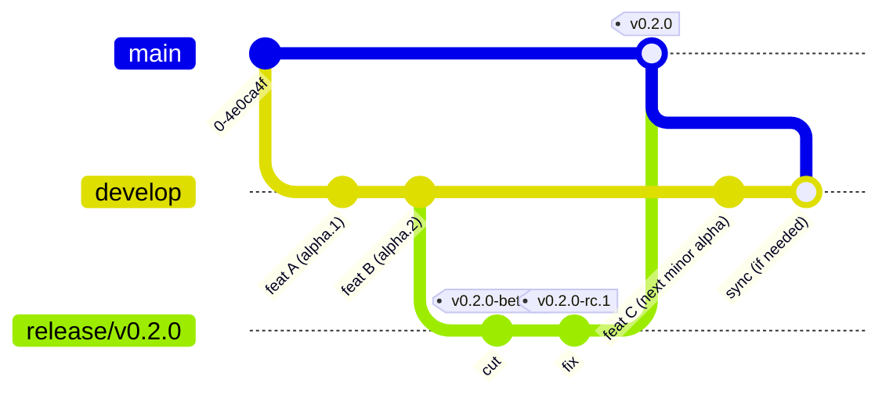
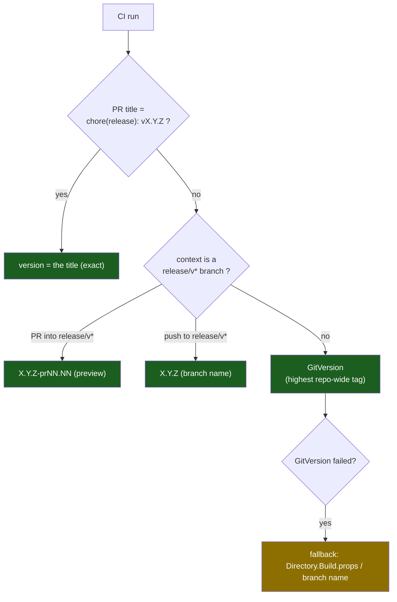
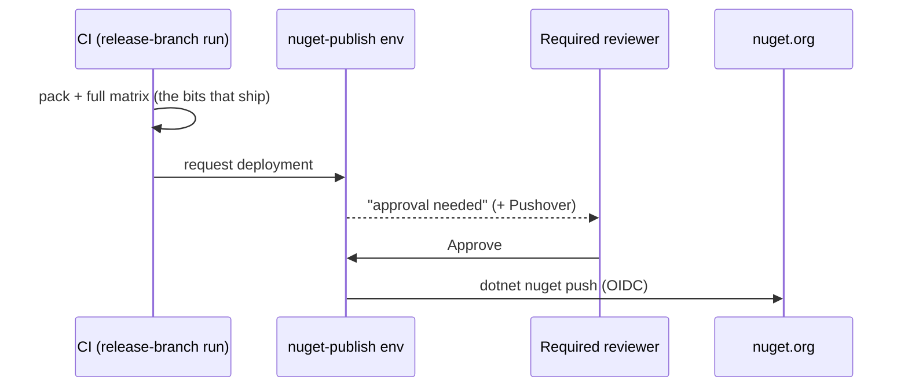

# Releasing & Versioning

> **Audience:** both humans and AI sessions. This is the single source of truth for how Whizbang
> decides a version, publishes packages, and keeps GitVersion in lock-step. If you touch anything in
> `.github/workflows/*version*`, `release.yml`, `start-release.yml`, `ci.yml`, or `nuget-*.yml`,
> update this document in the same PR.

## TL;DR

- **Three channels, one per gitflow branch.** `develop` publishes **alpha** automatically on every
  merge. An open `release/vX.Y.Z` branch publishes **beta** and **rc** when asked. `main` publishes
  **stable** when the release PR merges. Hotfixes are release branches too.
- **Nothing publishes past the PR gate: 100% coverage of new lines and zero Sonar findings.** That
  gate runs only on pull-request events, so every publish path requires a commit whose PR gate
  passed: develop merges and release PRs by merging, betas and rcs by the open release PR's gate on
  exactly that commit, an older-line hotfix by the fix PR merged into its branch
  (`.github/actions/require-pr-gate`).
- **Every published package is the tested build, or verified equivalent to it.** Nothing is rebuilt to
  publish: stable promotes the release branch's own packages, and a beta or rc repacks the release
  branch's binaries at the prerelease version (byte-identical DLLs). A clean release cut reuses the
  tests of the develop commit it came from, so its packages are **verified equivalent** to that
  tested build (same source, same SDK, same assembly set: the standard every alpha ships under);
  once a stabilization fix lands on the branch, it runs its own full matrix and they are the
  literally tested bytes.
- **One number, everywhere.** The version that is *printed* (PR preview) equals what is *published*
  to nuget.org, *stamped* into the `.nupkg`, and *tagged* in git (`vX.Y.Z`). If they differ, it's a bug.
- **The git tag is the source of truth for "what version are we at."** GitVersion derives the next
  version from the **highest repo-wide tag**, so every publish except the develop alphas creates a tag.
- **`Directory.Build.props` is a *local dev placeholder*.** The pipeline stamps the real version at
  build time and never reads it from that file (except as a last-ditch fallback if GitVersion fails).
- **Publishing to nuget.org waits for your approval** (the `nuget-publish` environment), unless the
  repository variable `PUBLISH_WITHOUT_APPROVAL` is `true`.
- **Claude sessions follow the `release` skill** (`.claude/skills/release/SKILL.md`), which maps any
  situation to the flow below and its recovery. Keep it in step with this document.

---

## Supported flows

These are the flows the pipeline intentionally supports. Anything not listed is unsupported, and
the enforcement points named in the last column refuse it.

| # | I want to… | Do this | What runs | Enforced by |
|---|---|---|---|---|
| F1 | Ship a change | PR from `feat/*`, `fix/*`, `test/*`, `ci/*`, … into `develop`; merge through the queue | CI (1 pre-merge, 2 merge queue, 3 post-merge); develop publishes the changed packages as **`0.Y.0-alpha.N`** | gitflow check; `develop` ruleset |
| F2 | Cut a release | Actions → **Start Release** from `develop`, `release_type: auto` | Creates `release/vX.Y.Z` and the PR `chore(release): vX.Y.Z` into `main`; CI 4 release candidate reuses the tested develop commit's results when only the version file differs (build, pack, verify: no suites) | one release in flight; branch must not exist |
| F3 | Publish a **beta** or **rc** | Actions → **Release Prerelease**, "Use workflow from" = the release branch, pick `beta` or `rc` | Repacks the branch head's tested build as **`X.Y.Z-beta.N`** / **`-rc.N`**, publishes, tags it on the branch. Nothing merges | release branch only; the open release PR's head is this commit and its coverage/Sonar gate passed on it; green CI; no beta after rc; not after stable |
| F4 | Fix something in an open release | PR from `fix/*` (or `bugfix/*`, `hotfix/*`) into `release/vX.Y.Z` | The branch re-tests; publish the next beta or rc when ready (F3); the fix reaches develop after release (F5) | gitflow check |
| F5 | Ship the **stable** release | Merge the release PR (merge commit) and approve `nuget-publish` | Promotes the release branch's tested packages as **`X.Y.Z`**, tags `main`, syncs `main` back to `develop` by PR; CI 5 released reuses the release branch's results | release PR must come from `release/vX.Y.Z` with its own stable number; tested tree must equal the tagged tree |
| F6 | Abandon a release | Close the release PR, delete the branch | Nothing publishes. A re-cut with `auto` reuses the same number if betas or rcs already shipped for it | — |
| F7 | Hotfix the **current** line | Branch `release/vX.Y.(Z+1)` from tag `vX.Y.Z`, push it, then push the fix | The push run opens the release PR into `main` itself; continue with F3/F5 | release guard |
| F8 | Patch an **older** line | Branch `release/vA.B.(C+1)` from tag `vA.B.C` and push it; put the fix on `fix/*` and PR it **into** `release/vA.B.(C+1)` | Merging the fix PR publishes **`A.B.(C+1)`**, then opens a develop-only back-merge PR; never touches `main` | release guard: a direct push is refused; the fix PR's coverage/Sonar gate must have passed |
| F9 | Recover a stuck release | See [Recovery](#recovery) | — | — |

**Deliberately unsupported:** a deliberate `alpha` cut (alpha is develop's channel; the first
complete prerelease is `beta.1`); a release branch with a label in its name
(`release/vX.Y.Z-beta.1`); any PR into `main` from a branch other than `release/v*`; `hotfix/*` into
`main`; squash-merging a release PR (the release path and CI 5 read the merge commit's parents);
`release_type: manual` except for recovery.

### Channel map

| Branch | Channel | Version | Complete? | Tagged? |
|---|---|---|---|---|
| `develop` | alpha | `0.Y.0-alpha.N` (N = commit height) | **changed packages only** | no |
| `release/vX.Y.Z` | beta, rc | `X.Y.Z-beta.N`, `X.Y.Z-rc.N` | all packages | yes, on the release branch |
| `main` | stable | `X.Y.Z` | all packages | yes, on `main` |
| `release/vA.B.C` (older line) | hotfix | `A.B.C` | all packages | yes, on the hotfix branch |

Precedence within one number falls out of the labels: `alpha.N < beta.N < rc.N < stable`. Develop
alphas are **partial by design**: each publishes only the packages whose content changed, so no
single alpha is a consumable set. Hand consumers a beta or later.

---

## Reading a run

**The run name says where a change is in its life.** Numbered so they sort in order:

| Run name | Event |
|---|---|
| `CI · 1 pre-merge · PR #N · branch` | a pull request |
| `CI · 2 merge queue` | the queue's prospective merge |
| `CI · 3 post-merge · develop (alpha)` | a merge landing on develop (publishes the alpha) |
| `CI · 4 release candidate · release/vX.Y.Z` | a push to a release branch |
| `CI · 5 released · main` | a release merge landing on main (records the main-line analysis) |
| `Release · cut · auto` | Start Release |
| `Release · 4 prerelease · beta · release/vX.Y.Z` | Release Prerelease |
| `Release · 6 publish stable · release/vX.Y.Z` | the release PR merged |

**The job name says what phase a job is in:** `Plan` (decide what runs), `Build`, `Test`,
`Analyze`, `Gate` (the merge-blocking verdicts), `Publish`, `Merge back`, `Report`, `Notify`. A job
from a reusable workflow shows as `Phase · Subject / Action`, e.g. `Test · Unit / Run suite`,
`Build · Compile / Compile and hash`, `Analyze · Quality / Sonar and coverage`. A **skipped**
reusable job shows only its parent name (`Test · Unit`), which is how a yielded suite reads.

The required checks are these names: `Gate · CI result` on `develop`; on `main`,
`Build · Compile / Compile and hash`, every suite leg except Azure Blob,
`Analyze · Quality / Sonar and coverage` and SonarCloud's own `SonarCloud Code Analysis`. Renaming a
job renames its check, so the branch rulesets must change in the same moment.

---

## Branching model (gitflow)

| Branch | Cut from | Merges to | Publishes |
|---|---|---|---|
| `feat/*`, `fix/*`, `test/*`, `ci/*`, `docs/*`, `perf/*`, `chore/*`, `refactor/*`, `plan/*`, `build/*`, `style/*`, `bugfix/*`, `hotfix/*`, `dependabot/*` | `develop` | `develop` | nothing (pre-merge CI) |
| `fix/*`, `bugfix/*`, `hotfix/*` | a release branch | that `release/vX.Y.Z` | nothing (the release branch re-tests) |
| `develop` | — | — (release branches are cut from it) | alpha |
| `release/vX.Y.Z` | `develop` (Start Release) or a tag (hotfix) | `main` | beta, rc (on request); older-line hotfix |
| `main` | — | — | stable |
| `sync/*` | `main` or a hotfix commit (automated) | `develop` | nothing |

Everything else is refused by the gitflow check (`Gate · Gitflow branch direction`).



**Key nuance: `main` and `develop` deliberately diverge.** The release branch carries a version bump
in `Directory.Build.props` that is **not** merged back into develop, which keeps its local
placeholder. This does **not** affect versioning (see
[GitVersion synchronization](#gitversion-synchronization--why-it-still-works)), and the post-release
sync skips when the bump is the only difference (see [Sync Main → Develop](#sync-main--develop)).

---

## How the version is decided

`reusable-version.yml` resolves a CI run's version with a strict priority. The **first** match wins:



- **Release-PR title override** exists so the **preview comment equals what publishes.** The title,
  the branch name and the published version must all be the same stable `X.Y.Z`; `release.yml`
  refuses anything else before tagging.

> [!WARNING]
> **The release PR title IS the version string, and nothing may follow it.** Put any description
> in the PR body. A title like `chore(release): v0.1024.0 (reconcile)` is refused by
> `Plan · Is this a release?`. To recover after a bad title merged, re-dispatch rather than re-title:
> `gh workflow run release.yml --ref main -f version=X.Y.Z -f release_type=auto -f dry_run=false`.
> **`dry_run` defaults to `true`**, so omitting it is a silent no-op that reports success.

- **Release-branch override:** on a release branch the branch name is the version (GitVersion
  would pick the highest repo-wide line, which is wrong on an older-line hotfix branch). A beta or
  rc takes the branch's number plus its label (F3).
- **GitVersion** handles everything else (feature PRs, develop).
- **Fallback** only fires if GitVersion itself errors.

**The resolved version is then used identically for pack, publish and tag:**

```
resolved version ──► dotnet pack -p:Version="$VERSION"   (the .nupkg version)
                 ├──► dotnet nuget push                    (publishes that exact version)
                 └──► git tag -a "v$VERSION"               (records it for GitVersion)
```

---

## Version increment rules

**Every release is at least a MINOR bump. The patch band is reserved for hotfixes.**

| Channel | Band | Who picks the number |
|---|---|---|
| develop (alpha) | **next minor**: `0.(Y+1).0-alpha.N` above the last tag | GitVersion (`develop: increment: Minor`), `N` = commit height |
| release cut | **minor**: `0.(Y+1).0` | Start Release, `release_type: auto` (GitVersion already computes the next minor) |
| beta, rc | the release branch's own number | Release Prerelease, numbered from the existing tags |
| hotfix | **patch**: `0.Y.(Z+1)` on an existing line | the `release/vX.Y.Z` **branch name** |

**Why (learned the hard way, 2026-07):** a deliberate cut once used develop's own label in the same
band (`0.959.1-alpha.1`) and sorted **below** an already-published develop build
(`0.959.1-alpha.12`), invisible to latest-version resolution. Two rules now make that impossible:
disjoint **bands** (develop computes one minor above the last tag) and disjoint **labels** (`alpha`
is develop's alone; release branches publish `beta` and `rc`).

**An open series pins its number.** Once `vX.Y.Z-beta.1` is tagged, GitVersion moves past `X.Y.Z`
(verified by running it: with `v0.2451.0-beta.1` as the highest tag, `auto` computes `0.2452.0`).
If that release is abandoned (F6) and re-cut, Start Release with `auto` offers `X.Y.Z` again
rather than skipping it: an open series is the highest `X.Y.Z` with beta or rc tags, no stable tag,
and above the highest stable release. `major`, `minor` and `patch` start a new number instead and
warn that the open series is left behind. `manual` is **recovery only** and accepts only `X.Y.Z`.

---

## GitVersion synchronization — why it still works

**GitVersion here derives the base version from the highest tag *repo-wide*, not by branch ancestry.**
This is load-bearing and easy to get wrong, so it's worth proving:

- The highest tag is `v0.2450.0`, and it is **not** reachable by ancestry from `develop` (it lives on
  the main-side merge commit, which is never merged back — see [branching](#branching-model-gitflow)).
- Yet develop computes `0.2451.0-alpha.75` (GitVersion 6.2 with this repo's `GitVersion.yml`).

The only way `0.2451.0` can appear is GitVersion taking `v0.2450.0` (the highest tag anywhere in the
repo) and applying develop's `increment: Minor` + `label: alpha` + commit height. A prerelease tag
counts too: with `v0.2451.0-beta.1` as the highest tag, develop computes `0.2452.0-alpha.N`, even
before the release syncs back to develop, and so does `start-release` with `release_type: auto`.
That is why an open beta/rc series pins its number (see [Version increment rules](#version-increment-rules)).
So:


**Consequences:**
- Every release **must** create a tag (it does — `release.yml` and `nuget-publish.yml` both tag).
  Develop alphas intentionally don't tag; they derive from the base tag + height.
- A **manual/override** version is still reflected, because it is what gets tagged.
- `release.yml` **fails if the tag already exists** — you can never re-publish a version, and the
  tag history can never silently disagree with GitVersion.
- A **lower** version (a backport tag `< highest`) will not advance the mainline base — correct.

---

## The approval gate

The `push` job in `nuget-push.yml` declares `environment: nuget-publish`, which has a **required
reviewer**. Every publish path funnels through it, so **nothing reaches nuget.org without an approval**
in the GitHub Actions UI. (`release-approval`, used by release.yml's "Approve Release" job, has no
rules today and auto-passes — the real gate is `nuget-publish`.)

### Standing the gate down

Set the repository variable **`PUBLISH_WITHOUT_APPROVAL`** to `true` and every publish goes straight
out, for as long as it stays set. Unset it to put the gate back. Nothing else changes: same job, same
packages, same attestation.

It works by choosing the environment rather than by skipping the wait, because the wait belongs to
the environment and a job cannot ask to be reviewed conditionally:

| `PUBLISH_WITHOUT_APPROVAL` | environment | behavior |
|---|---|---|
| unset, or anything but `true` | `nuget-publish` | waits for a required reviewer |
| `true` | `nuget-publish-auto` | publishes unattended |

Two things to do before the first time you set it:

1. **Create the `nuget-publish-auto` environment** with no protection rules. A publish that names an
   environment which does not exist does not fall back to the protected one.
2. **Give nuget.org a trusted-publishing policy that accepts it.** The OIDC token carries the
   environment name, so a policy naming `nuget-publish` rejects a token minted under
   `nuget-publish-auto` with a policy mismatch. Either add a second policy or drop the environment
   from the existing one. This fails at the push, after the packages are built, attested and
   uploaded — not at the gate.

A run that published without review says so in its job summary, so the two cases do not read alike
afterwards.



---

## CI skips redundant matrices (queue-validated + ff-validated + release-pr)

Every merge used to run the full test matrix **three** times — the PR run, the merge-queue run,
and the post-merge develop push run, and every release cut ran it twice over one commit. Three
guards in `ci.yml` remove the redundant legs while keeping every publish gate provable. A
fast-forward merge now runs the matrix **once** (the PR run); a real merge (develop moved) runs it
**twice** (PR + queue); a release, from cut to main, runs it **once** (the release-branch push run).

### ff-validated — skip the redundant *queue* matrix on a fast-forward

When a single PR's branch already contains the current develop tip, the merge queue's
prospective-merge commit has a tree **byte-identical** to what the PR run already tested in full.
`ff-validated` (merge_group runs only) detects this and skips the build, format, the six suites and
quality in the queue run:

- It reads the queue commit's parents: exactly two (base + one PR head) means a single-PR group;
  more means a batch, which the PR runs never tested as-merged → full matrix.
- It requires the queue commit's **tree** to equal the PR head's tree (the merge added nothing —
  a true fast-forward). develop is append-only, so an identical tree proves the PR run's own
  test-merge was this exact tree.
- It requires the PR run for that head to have gone fully green **including Quality**, so a
  dependabot PR (whose Quality is skipped) still gets a real queue run.
- It requires that PR run's **build manifest** to still be live, because a skip also skips the
  queue's own **Build**: the develop push's verify-rebuild then reads the PR run's manifest instead
  (below), re-proving that the pushed tree is the PR head's.
- Any uncertainty (batched group, moved develop, missing or non-green PR run, expired manifest)
  falls through to the full queue matrix, build included.

Escape hatch: repo variable `QUEUE_RUN_FULL_MATRIX=true` forces the full queue matrix.

### queue-validated — skip the redundant *push* and *release cut* matrices

Two pushes carry a tree another run already tested:

- **A develop push.** The merge queue fast-forwards develop to the **exact SHA** it just ran, so the
  post-merge push used to re-test identical bytes for ~35-40 minutes before the alpha could publish.
- **A release cut.** `release/vX.Y.Z` is the develop commit it was cut from plus changes to
  `Directory.Build.props` only (main's previous version, then the new one), a file the build does not
  read: the version is stamped from the branch name. The cut used to re-run the whole matrix on code
  develop had already tested, delaying the release PR by ~40 minutes.

`ci.yml` short-circuits both while keeping the publish gate provable:

- **queue-validated** decides. On develop it targets the pushed SHA; on a release branch it asks the
  compare API for the merge base with develop and every differing file, and targets that merge base
  only when `Directory.Build.props` is the **only** difference. A stabilization fix on the branch, a
  hotfix branch cut from a tag, or anything else runs the full matrix.
- **find-tested-run** (`.github/actions/find-tested-run`, the one copy of this lookup) finds the
  evidence for the target: the successful `merge_group` run, and the run holding its coverage and its
  determinism manifest (the queue run, or on a fast-forward the PR run, after proving the trees are
  identical). `validated` is true only if **both** are still live; otherwise the full matrix runs.
  Found ⇒ the six suites and quality skip in the push run.
- **verify-rebuild** replaces them on the publish path. It reads the determinism manifest of the run
  that built this tree (the queue run, or on a fast-forward the PR run), requires that run's exact SDK
  and rebuilds at the queue's placeholder version, then confirms the built **assembly set**
  matches the queue run's determinism manifest (`reusable-build.yml` uploads one on every run).
  Same commit SHA + same SDK + same assembly set is the safety argument — identical source on an
  identical toolchain behaves like what the suites tested. Byte-for-byte hash identity is
  reported for monitoring but is **not** a gate: source generators emit nondeterministically for
  an unpredictable subset of assemblies (`[LoggerMessage]` partial-class ordering, ILRepack
  MVIDs), so a hash comparison flakes and a name allowlist can never be complete. Tamper-evidence
  for the published bits is the SLSA provenance attestation, not this rebuild.
- **reupload-reports** republishes the tested run's coverage and TRX into the push run, both to
  Codecov and as its own `coverage-republished` artifact, so the Codecov baseline, Test Analytics,
  the docs test status and, on a release cut, the release PR's and the main push's Quality (which
  read coverage from this run) keep working unchanged. Quality recognizes a run that republished
  instead of running suites.

`prerelease-publish` accepts either gate: every suite green **in this run** (the old invariant,
still the path whenever queue validation is absent — a standalone push, an expired queue run,
the escape hatch), or **queue-validated + verify-rebuild green**.

**Escape hatches:** `RELEASE_CUT_FULL_MATRIX=true` forces the full matrix on release-branch pushes.
On develop, set the repo variable `PUSH_RUN_FULL_MATRIX=true` and re-run **all jobs** on
the push run to force the full matrix. That is the remedy when verify-rebuild refuses a
toolchain drift (e.g. an SDK patch released in the minutes between the queue run and the push
run) — the publish stays blocked until either the drifted rebuild is validated by real suites or
the next merge lands.

### release-pr — skip the redundant *release PR* and *main push* matrices

Two events re-test a tree another run already covers, and `release-pr` makes both yield **format,
build and the six suites** (and so pack) to that run:

- **The release PR.** `start-release` pushes `release/vX.Y.Z` **and** opens the release PR at the same
  commit. The push run must run everything, because only it can publish; the PR run only gates the
  merge. The required checks on `main` are satisfied by the push run's results, which carry the same
  check names on the same commit. It yields only to a push run that can still report green: one
  already **canceled or failed** keeps the matrix in the PR run.
- **The main push.** Merging the release PR pushes `main`, whose tree is byte-identical to the
  release-branch tree that just went green (`start-release` merges main in first). The push to main
  yields to that release-branch run: about 46 minutes per release. It fails safe: a non-merge push,
  a merge that changed the tree, or no green release-branch run keeps the full matrix.

**Quality never yields.** SonarScanner runs only on a pull request or on `main`, so the release PR's
Quality and the main push's Quality are the only analyses those trees get (the release-branch push
run's Quality builds and checks coverage but does not scan). Each one takes its **coverage from the
run it yielded to** (`coverage-run-id`), waiting for that run's suites, because its own run
produces none.

Each release-PR yield posts one **sticky PR comment** naming the push run. If that run is later
canceled or fails, the PR blocks with no failing check of its own, and the comment is where the
recovery lives: **re-run the push run** (`gh run rerun <id> --failed`). Its fresh results land on
the same commit.

**Escape hatches:** repo variable `RELEASE_PR_FULL_MATRIX=true` (then re-run the PR's CI run) forces
the full matrix in a release PR run; `MAIN_PUSH_FULL_MATRIX=true` does the same for a main push.
Unset them afterwards.

---

## `Directory.Build.props`

- On `develop` it holds a **local placeholder** like `<Version>0.100.0-local.111</Version>`.
- The **pipeline stamps** the real version at build time (`-p:Version=…`); it does **not** read the
  version from this file — the flow is "gitflow decides the version → pipeline stamps it", *not* the
  other way around.
- `start-release` writes the chosen version into it on the release branch so local builds of that
  branch match; that commit stays on the release branch / `main` and is **not** synced into develop.
- Only edit it for **local** development, and only with a `-local.*`-suffixed value.

---

## Sync Main → Develop

After a release publishes, the `sync-develop` job reconciles main into develop **via a PR, never a
direct push** (develop is protected). The mechanism lives in `reusable-sync-develop.yml` and has two
callers: `release.yml` after a merge to main (source: `main`), and `ci.yml` after an older-line
hotfix publishes (source: the hotfix commit, which never reaches main; see [Hotfixes](#hotfixes)).

- It compares main and develop with a **three-dot diff** (`origin/develop...origin/main`) so it only
  considers what the *release* added, not develop's own post-cut progress.
- If the only difference is the `Directory.Build.props` version bump (the common case), it **skips** —
  develop keeps its local placeholder, and versioning doesn't need the bump (GitVersion uses the tag).
- If main has *real* release-stabilization changes develop lacks, it opens a **review PR** into
  develop with `Directory.Build.props` restored to develop's value.

---

## Cutting a release: step by step

**1. Cut (F2).** Actions → **Start Release** → *Run workflow* from `develop`:

| `release_type` | Version | When |
|---|---|---|
| `auto` | GitVersion's number (already the next minor), or an open series' number | **every normal release** |
| `major` | GitVersion base, major bump | a breaking release |
| `minor` / `patch` | GitVersion base, bumped once more | rarely: `auto` already lands in the next minor band |
| `manual` + `manual_version` (`X.Y.Z` only) | exactly what you type | **recovery only** |

It refuses while another release PR is open, or if the branch already exists. It creates
`release/vX.Y.Z`, **merges `main` into it** (so the PR is conflict-free, see below), writes the
version into `Directory.Build.props`, and opens the PR `chore(release): vX.Y.Z` into `main`. The
push runs the full matrix once (CI · 4 release candidate); the PR's own run reuses those results and
runs only its Sonar analysis on their coverage.

**2. Prerelease, as often as needed (F3).** Actions → **Release Prerelease**, "Use workflow from" =
`release/vX.Y.Z`, choose `beta` or `rc`. It publishes the branch head's tested build as the next
`X.Y.Z-beta.N` or `X.Y.Z-rc.N` and tags it on the branch:

| Tags so far for `0.2452.0` | Choose | Publishes |
|---|---|---|
| none | `beta` | `0.2452.0-beta.1` |
| `-beta.1` | `beta` | `0.2452.0-beta.2` |
| `-beta.1`, `-beta.2` | `rc` | `0.2452.0-rc.1` |
| `-rc.1` | `beta` | **refused**: a beta would sort below the rc already shipped |
| `0.2452.0` | either | **refused**: it shipped; that's a hotfix |

It refuses unless the branch head's CI run is complete and green and its build is still kept (7 days
on a release branch). The packages are that build **repacked**, not rebuilt: every DLL is
byte-identical to what the suites ran; only the package version differs. (The assemblies'
informational version therefore reads `X.Y.Z`; the package version is authoritative.)

**3. Stabilize (F4).** Fixes go in as PRs from `fix/*` into `release/vX.Y.Z`. Each push re-tests the
branch; publish the next beta or rc when ready.

**4. Ship (F5).** Merge the release PR **with a merge commit**, then approve `nuget-publish` in the
Actions UI. `release.yml` promotes the tested packages (below), tags `main`, and syncs `main` back to
`develop`. The push to `main` (CI · 5 released) reuses the release branch's results and records the
main-line Sonar analysis.

> **Why start-release merges main first.** `main` carries the *previous* release's version in
> `Directory.Build.props` while `develop` keeps its local placeholder, so the two have diverged
> (`main` is not an ancestor of `develop`). Without reconciling, **every** release PR would conflict on
> that one line. `start-release` merges `main` into the fresh release branch and resolves that single
> expected conflict (the version is re-stamped immediately after), so the PR to `main` opens clean
> without ever touching develop's placeholder. Any *other* conflict fails the run loudly. It is also
> what makes the merged tree byte-identical to the tested one.

### Releases promote the tested packages

`release.yml` never rebuilds. The release-branch push run already packed every package at the release
version, and either ran the full matrix against exactly those bytes or (a clean cut) proved its build
equivalent to the tested develop build, so the release publishes that run's `nuget-packages-<run>`
artifact as-is. `Plan · Locate the tested packages` runs **before anything is
tagged** and fails closed if any of these does not hold:

- HEAD's tree is byte-identical to the tested release-branch tree;
- that release-branch run is green;
- its package artifact still exists (kept 7 days on a `release/v*` run).

`Plan · Is this a release?` has already required that the PR came from `release/vX.Y.Z` with the same
stable number in its title, and every package must carry exactly that version (the one package list,
`.github/nuget-packages.txt`, checked by `.github/actions/verify-packages`). A failure leaves no tag
and no draft release behind. It never falls back to a rebuild: that would publish bytes no suite ran
against.

### Prerelease vs final

- A version **with** a label (`-beta.1`, `-rc.1`) publishes as a **GitHub Pre-Release** and a NuGet
  prerelease. Use it to give consumers a **complete, consumable** build to validate.
- A version **without** a label is a **stable** release. The stable tag (`v0.2452.0`) is distinct
  from every prerelease tag, so shipping never collides.

---

## Hotfixes

A **bugfix** branches from `develop`, merges through an ordinary PR, and ships in the next release:
nothing special (F1). A **hotfix** ships out of band on a `release/vX.Y.Z` branch cut by hand from the
tag of the line it patches:

1. `git switch -c release/v0.2450.1 v0.2450.0` and push the branch **before** the fix. The creation
   push is ignored.
2. Current line: commit the fix and push; the release PR it opens runs the gate. Older line: put the
   fix on `fix/<name>` and open a PR into the hotfix branch; merging it publishes.

The push run's `Plan · Route the hotfix by line` compares the branch version with the highest stable
tag:

| Line | Example (highest stable `0.2451.0`) | What happens |
|---|---|---|
| **Current** (above it), F7 | `release/v0.2451.1` | It **opens the release PR into `main`** (title `chore(release): v0.2451.1`) instead of publishing. From there it is an ordinary release: beta/rc if wanted (F3), then merge (F5), which syncs develop. |
| **Older** (at or below it), F8 | `release/v0.2450.1` | The fix must arrive as a PR **into** the hotfix branch (a direct push is refused), so its coverage and Sonar gate runs on it. Merging that PR publishes through `Publish · Hotfix (older line)` (after the approval gate), then `Merge back · Hotfix to develop` opens a **develop-only** back-merge PR. It never touches `main`, which would regress main to an older release. |

Either way the fix reaches develop, so the next cut cannot silently ship without it. The back-merge
PR may conflict when the lines have diverged; resolve it like any PR.

---

## Recovery

| Symptom | Cause | Do this |
|---|---|---|
| Release PR blocked, no failing check of its own | the release-branch push run it yielded to was canceled or failed | Re-run that run: `gh run rerun <id> --failed` (the sticky PR comment names it). Or set `RELEASE_PR_FULL_MATRIX=true` and re-run the PR's CI, then unset it |
| `Analyze · Quality` canceled at its time limit | runners queued the suites for hours | Re-run the failed jobs; the suites' coverage is still there |
| `Plan · Locate the tested packages` failed: expired or not green | the release PR sat open past 7 days, or its run went red | Re-run the release-branch CI run (all jobs), then `gh workflow run release.yml --ref main -f version=X.Y.Z -f release_type=auto -f dry_run=false` |
| `Plan · Is this a release?` refused the merged PR | the title or branch didn't match `chore(release): vX.Y.Z` from `release/vX.Y.Z` | Re-dispatch as above with the right version; never re-title and re-merge |
| Release Prerelease refused: "build has expired" / "not green" | the branch head's run is older than 7 days, running, or red | Re-run that CI run (or push), wait for green, retry |
| Release Prerelease refused: "gate did not pass" / "PR's head is not this commit" | the release PR's Quality or SonarCloud check failed, or is still running, on the branch head | Fix it in the release branch through a PR until the release PR is green on its head, then retry |
| Older-line hotfix refused: "pushed directly" | the fix was pushed to the hotfix branch instead of merged through a PR | Put the fix on `fix/<name>`, PR it into the hotfix branch, merge when green |
| Start Release refused: "release PR still open" | one release is in flight | Merge it (F5) or close it (F6), then retry |
| Develop alpha blocked at `Build · Verify rebuild matches the tested build` | SDK drift between the queue run and the push run, or no live manifest | Set `PUSH_RUN_FULL_MATRIX=true` and re-run all jobs on the push run; unset afterwards |
| Release cut red at `Build · Verify rebuild matches the tested build` | SDK drift since the develop commit was tested, or its manifest expired | Set `RELEASE_CUT_FULL_MATRIX=true` and re-run all jobs on the release-branch run; unset afterwards |
| A published prerelease out-sorts develop's current builds ("latest" resolves to old code) | a release cut was abandoned after develop had published in the cut's next band (#872): the open branch raised develop's number, deleting it lowered it again | Find the commit that first published the stale version (its develop run's push log), **tag it with that version** (`git tag -a vX.Y.Z-alpha.N <sha>`; it records a version that really shipped, and develop then computes above it), and **unlist** that version on nuget.org for every package. Never set a version floor in `GitVersion.yml`: versions come from tags only |
| A job in a release run failed for a flaky test | a real flake | Re-run the failed jobs to unblock, **and** fix the flake in a PR (flakes are fixed on sight, never parked) |

`dry_run` on `release.yml` defaults to `true`: a dispatch without `-f dry_run=false` reports success
and publishes nothing.

---

## Gotchas & invariants (for future edits)

- **Never** make the printed/preview version differ from what publishes. If you change one version
  source, check all three consumers (pack stamp, nuget push, git tag) still agree.
- **Never** push directly to `develop` or `main` — both are protected; use a PR. Automated jobs that
  need to reach a protected branch must open a PR (see `sync-develop`).
- **Concurrency:** the CI concurrency group includes `github.event_name` so a release **PR** run can
  never cancel the release-branch **push** run (a publish must never be canceled mid-push). Don't
  collapse them back into one group — that reintroduces the spurious canceled `Gate · CI result` that
  blocks release merges.
- **Required status checks** on `main`/`develop` must match the *current* CI job names. If you rename
  a job (e.g. split "Service Bus Integration" into `(whizbang)`/`(ecommerce)`), update the branch
  ruleset's required checks or every merge wedges on a phantom "expected" check.
- **Tags are forever.** Because GitVersion keys on the highest repo-wide tag, a stray high tag
  (e.g. an accidental `v9.9.9`) will hijack every subsequent version. Delete mistaken tags promptly.
- **The develop-push matrix skip is SHA-keyed and fails closed.** `queue-validated` skips the
  suites only when a successful `merge_group` CI run exists for the *exact* pushed SHA, and the
  publish then additionally requires `verify-rebuild`'s same-SDK + same-assembly-set check.
  Anything else — a direct push, an expired queue run, SDK drift, a changed assembly set,
  `PUSH_RUN_FULL_MATRIX=true` — falls back to the full matrix or blocks the publish. Never widen
  the match beyond the exact SHA. Do NOT reintroduce a byte-identity hash gate: generator
  nondeterminism makes it flake (it blocked a publish once, #691); the SLSA provenance
  attestation is the tamper-evidence on the published bits.
- **The fast-forward queue skip is tree-keyed and fails safe.** `ff-validated` skips the queue
  suites only for a single-PR group whose merge tree is byte-identical to a fully-green (incl.
  Quality) PR run's tree. Every uncertain path emits `skip=false` (full queue matrix) and the job
  never fails the run. Never loosen the single-PR / identical-tree / PR-run-green trio — those
  three together are what make trusting the PR run in place of the queue run sound. The queue's
  **Build** skips too, so the skip also requires the PR run's determinism manifest to be live, and
  verify-rebuild falls back to it only after re-proving the pushed tree is the PR head's. Never skip
  the queue build without both halves: a push with no manifest to read blocks the alpha (#844).
- **Two publish paths don't compete.** A push to a `release/v*` branch can publish via
  `ci.yml`'s `release-publish`, and the merge to main publishes via `release.yml` — both would target
  the same version+tag. The `release-guard` job skips `release-publish` whenever the branch has an
  **open PR into main** (the merge will publish), so a conflict fix or stabilization push to a release
  branch never spawns a competing approval-gate deployment. Only older-line hotfix branches publish on
  push; a current-line one gets a PR instead (see [Hotfixes](#hotfixes)).
- **GitHub applies `success()` to a job implicitly, unless its `if` contains a status-check
  function.** Most jobs in `ci.yml` open with `!failure() && !cancelled()` so a skipped need does not
  poison them, which also removes the implicit gate. Both publish jobs (`prerelease-publish`,
  `release-publish`) therefore **name every result they depend on**. Never collapse those back into
  an implicit gate: adding a status-check function to a plain `if` silently deletes the whole test
  gate.
- **Address workflow runs by path, never by `.name`.** `ci.yml` sets a `run-name` (a `release/v*`
  push is a "release cut", a develop push "post-merge"), so no run is named plain "CI". Look runs up
  with `repos/$REPO/actions/workflows/ci.yml/runs?...`; filtering on `.name` silently matches
  nothing, and has broken two gates.
- **Quality derives its coverage count.** It waits for one `coverage-*` artifact per suite leg,
  counting legs from the jobs list once Build succeeds. Suite legs must stay named
  `<suite> / <...> Tests`; a finished-green set with a missing artifact fails loudly. Its job budget
  (180 minutes) is sized for runner queueing, because it starts with the run and waits.
- **A `pull_request` trigger filters on the BASE branch only.** There is no head-branch filter, so a
  release PR always starts a CI run. Its jobs can yield (release-pr), but the run itself cannot be
  prevented, which is why a release PR still shows a row per yielded job.
- **`main` is protected by a ruleset, not classic branch protection.** `.../branches/main/protection`
  returns 404 "Branch not protected"; the 13 required checks are at
  `gh api repos/<owner>/<repo>/rules/branches/main`.
