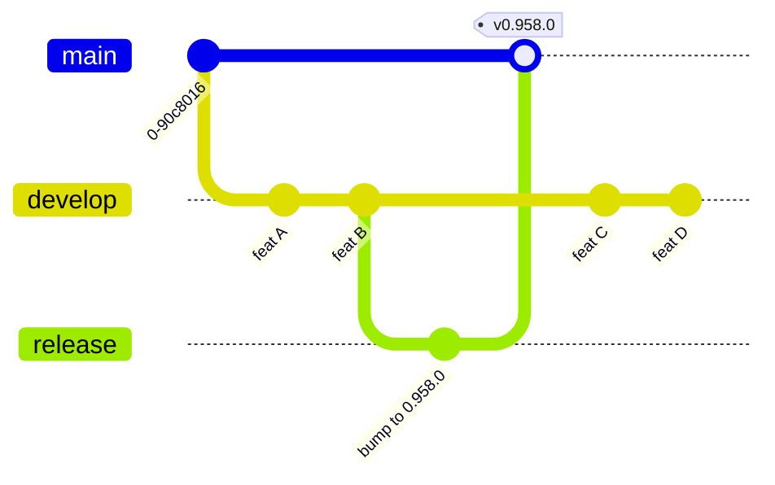
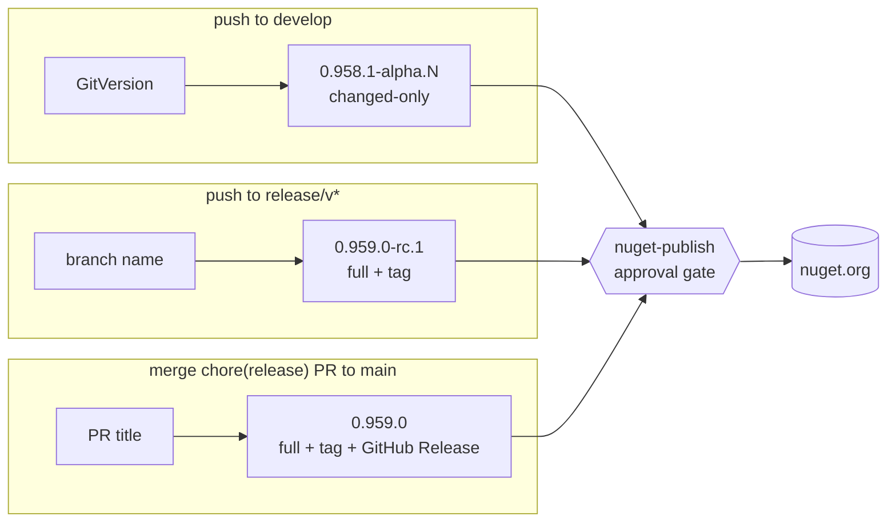
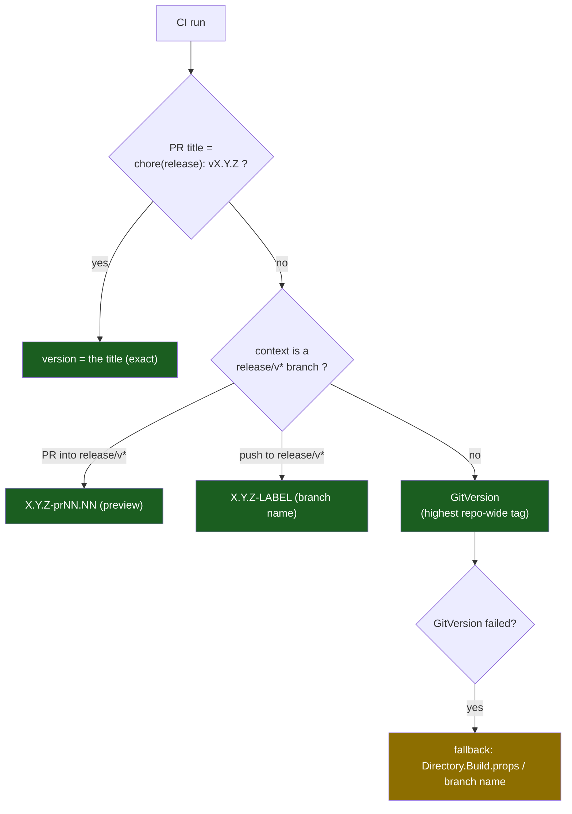
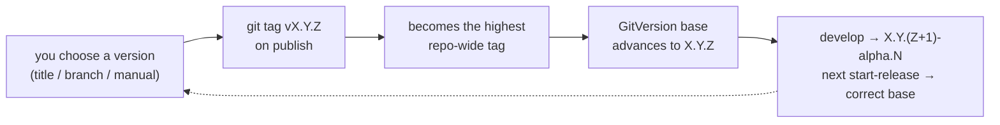
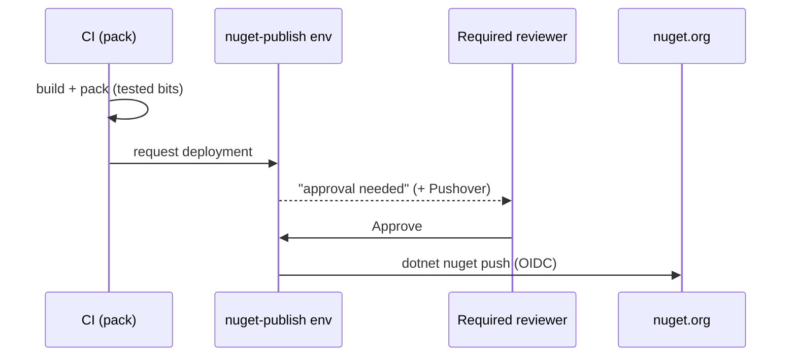

# Releasing & Versioning

> **Audience:** both humans and AI sessions. This is the single source of truth for how Whizbang
> decides a version, publishes packages, and keeps GitVersion in lock-step. If you touch anything in
> `.github/workflows/*version*`, `release.yml`, `start-release.yml`, `ci.yml`, or `nuget-*.yml`,
> update this document in the same PR.

## TL;DR

- **One number, everywhere.** The version that is *printed* (PR preview) equals what is *published*
  to nuget.org, *stamped* into the assemblies/`.nupkg` (`dotnet pack -p:Version=…`), and *tagged* in
  git (`vX.Y.Z`). These can never legitimately diverge — if they do, it's a bug.
- **The git tag is the source of truth for "what version are we at."** GitVersion derives the next
  version from the **highest repo-wide tag**, so every release must create a matching tag (they do).
- **`Directory.Build.props` is a *local dev placeholder*, not the source of truth.** The pipeline
  stamps the real version at build time; it never reads the version *from* that file (except as a
  last-ditch fallback if GitVersion itself fails).
- **Publishing to nuget.org is gated behind your approval** (the `nuget-publish` GitHub Environment).
  Nothing reaches nuget.org until a required reviewer approves.

---

## Branching model (gitflow)

| Branch | Purpose | Publishes | Merges to |
|---|---|---|---|
| `feature/*`, `fix/*` | day-to-day work | nothing (PR CI only) | `develop` (via PR) |
| `develop` | integration line | **alpha prereleases** (changed-only) | — (release branches cut from here) |
| `release/vX.Y.Z[-label]` | prepare a release | optional prerelease on push | `main` (via the release PR) |
| `main` | released history | the **final** version on merge | — (tags live here) |

The `release` branch below is `release/vX.Y.Z` in practice; simplified here for the diagram.



**Key nuance — `main` and `develop` deliberately diverge.** The release branch carries a version bump
in `Directory.Build.props` (e.g. `0.958.0`) that is **not** merged back into develop — develop keeps
its local placeholder (`0.100.0-local.NNN`). This is intentional and does **not** affect versioning
(see [GitVersion synchronization](#gitversion-synchronization--why-it-still-works)). The post-release
`Sync Main to Develop` job therefore does nothing in the common case (see [that section](#sync-main--develop)).

---

## The three publish channels

There is exactly one place packages are pushed to nuget.org (`nuget-push.yml`, gated on the
`nuget-publish` environment), but three ways to *reach* it:

| Channel | Trigger | Version comes from | Completeness | Creates a git tag? | Example |
|---|---|---|---|---|---|
| **Develop alpha** | push/merge to `develop` | GitVersion (`highest tag` + Patch + `alpha` + height) | **changed-only** (partial) | no | `0.958.1-alpha.5` |
| **Release-branch** | push to an existing `release/v*` (non-creation) | the **branch name** | full (all packages) | yes | `0.959.0-rc.1` |
| **Release (final)** | merge a `chore(release): vX.Y.Z` PR into `main` | the **PR title** | full (all packages) | yes | `0.959.0` / `0.959.0-alpha.1` |

> ⚠️ **Changed-only caveat.** Develop alphas republish *only the packages whose content changed* and
> stamp lockstep inter-package dependency requirements, so a given `alpha.N` can be a partial,
> **unconsumable** version set. For anything a consumer (e.g. a consumer application) will restore, use a **full**
> publish — a release-branch push or a release (final) — which always publishes all packages.



---

## How the version is decided

`reusable-version.yml` resolves the version with a strict priority. The **first** match wins:



- **Release-PR title override** (top priority) exists so the **preview comment equals what publishes.**
  A release PR (`chore(release): vX.Y.Z` into `main`) publishes exactly the title version on merge —
  `release.yml` reads that same title — so the preview must show it verbatim (no GitVersion, no `-pr`
  suffix). Keyed on the *title* (not the branch name) so an edited title still previews correctly.
- **Release-branch override** covers pushes to / PRs into a `release/v*` branch, where the branch name
  is the deterministic version source (GitVersion would otherwise pick the highest *repo-wide* line,
  which is wrong on an old-line hotfix branch).
- **GitVersion** handles everything else (feature PRs, develop) — see below.
- **Fallback** only fires if GitVersion itself errors.

**The resolved version is then used identically for publish, stamp, and tag** — that's the invariant:

```
resolved version ──► dotnet pack -p:Version="$VERSION"   (stamps assemblies + .nupkg)
                 ├──► dotnet nuget push                    (publishes that exact version)
                 └──► git tag -a "v$VERSION"               (records it for GitVersion)
```

---

## GitVersion synchronization — why it still works

**GitVersion here derives the base version from the highest tag *repo-wide*, not by branch ancestry.**
This is load-bearing and easy to get wrong, so it's worth proving:

- The only `0.958.x` tag is `v0.958.0`.
- `v0.958.0` is **not** reachable by ancestry from `develop` (it lives on the main-side merge commit,
  which is never merged back — see [branching](#branching-model-gitflow)).
- The highest tag *reachable by ancestry* from develop is ancient (`v0.10.10-alpha.1`).
- Yet develop publishes `0.958.1-alpha.5`.

The only way `0.958.1` can appear is GitVersion taking `v0.958.0` (the highest tag anywhere in the
repo) and applying develop's `increment: Patch` + `label: alpha` + commit height. So:



**Consequences:**
- Every release **must** create a tag (it does — `release.yml` and `nuget-publish.yml` both tag).
  Develop alphas intentionally don't tag; they derive from the base tag + height.
- A **manual/override** version is still reflected, because it is what gets tagged.
- `release.yml` **fails if the tag already exists** — you can never re-publish a version, and the
  tag history can never silently disagree with GitVersion.
- A **lower** version (a backport tag `< highest`) will not advance the mainline base — correct.

---

## The approval gate

The `push` job in `nuget-push.yml` declares `environment: nuget-publish`, which has a **required
reviewer**. Every publish path funnels through it, so **nothing reaches nuget.org without an approval**
in the GitHub Actions UI. (`release-approval`, used by release.yml's "Approve Release" job, has no
rules today and auto-passes — the real gate is `nuget-publish`.)



---

## `Directory.Build.props`

- On `develop` it holds a **local placeholder** like `<Version>0.100.0-local.111</Version>`.
- The **pipeline stamps** the real version at build time (`-p:Version=…`); it does **not** read the
  version from this file — the flow is "gitflow decides the version → pipeline stamps it", *not* the
  other way around.
- `start-release` writes the chosen version into it on the release branch so local builds of that
  branch match; that commit stays on the release branch / `main` and is **not** synced into develop.
- Only edit it for **local** development, and only with a `-local.*`-suffixed value.

---

## Sync Main → Develop

After a release publishes, the `sync-develop` job reconciles main into develop **via a PR, never a
direct push** (develop is protected):

- It compares main and develop with a **three-dot diff** (`origin/develop...origin/main`) so it only
  considers what the *release* added, not develop's own post-cut progress.
- If the only difference is the `Directory.Build.props` version bump (the common case), it **skips** —
  develop keeps its local placeholder, and versioning doesn't need the bump (GitVersion uses the tag).
- If main has *real* release-stabilization changes develop lacks, it opens a **review PR** into
  develop with `Directory.Build.props` restored to develop's value.

---

## Cutting a release — step by step

Use `start-release` (Actions → **Start Release** → *Run workflow*, from `develop`):

| `release_type` | Version | When |
|---|---|---|
| `manual` + `manual_version` | exactly what you type (e.g. `0.959.0-alpha.1`) | full control / prereleases |
| `minor` | GitVersion base, minor bump (`0.958.0` → `0.959.0`) | normal feature release |
| `patch` | GitVersion base, patch bump (`0.958.0` → `0.958.1`) | finish the current alpha line |
| `major` | GitVersion base, major bump | breaking release |
| `auto` | whatever GitVersion computes | rarely needed |

It creates `release/vX.Y.Z[-label]`, writes the version into `Directory.Build.props`, and opens a PR
to `main` titled `chore(release): vX.Y.Z[-label]`. Then:

1. **Review the PR.** The version-preview comment now shows the exact version that will publish.
2. **Merge it.** `release.yml` runs: creates the tag, packs, and requests the `nuget-publish` approval.
3. **Approve** in the Actions UI → packages publish to nuget.org.

### Prerelease vs final

- A version **with** a label (`-alpha.1`, `-beta.1`, `-rc.1`) publishes as a **GitHub Pre-Release**
  (the "Create GitHub Pre-Release" step fires because the version contains `-`) and marks the nuget
  package as a prerelease. Use it to give consumers a **complete, consumable** build to validate.
- A version **without** a label is a **stable** release. The stable tag (`v0.959.0`) is distinct from
  any prerelease tag (`v0.959.0-alpha.1`), so promoting alpha → stable never collides.

**Typical flow:** cut `0.959.0-alpha.1` → validate → cut `0.959.0` (stable). GitVersion tracks the
highest tag throughout, so develop moves onto the `0.959.x` line automatically after the alpha tag,
and `start-release minor` after the stable computes `0.960.0`.

---

## Gotchas & invariants (for future edits)

- **Never** make the printed/preview version differ from what publishes. If you change one version
  source, check all three consumers (pack stamp, nuget push, git tag) still agree.
- **Never** push directly to `develop` or `main` — both are protected; use a PR. Automated jobs that
  need to reach a protected branch must open a PR (see `sync-develop`).
- **Concurrency:** the CI concurrency group includes `github.event_name` so a release **PR** run can
  never cancel the release-branch **push** run (a publish must never be cancelled mid-push). Don't
  collapse them back into one group — that reintroduces the spurious cancelled-`CI Result` that
  blocks release merges.
- **Required status checks** on `main`/`develop` must match the *current* CI job names. If you rename
  a job (e.g. split "Service Bus Integration" into `(whizbang)`/`(ecommerce)`), update the branch
  ruleset's required checks or every merge wedges on a phantom "expected" check.
- **Tags are forever.** Because GitVersion keys on the highest repo-wide tag, a stray high tag
  (e.g. an accidental `v9.9.9`) will hijack every subsequent version. Delete mistaken tags promptly.
