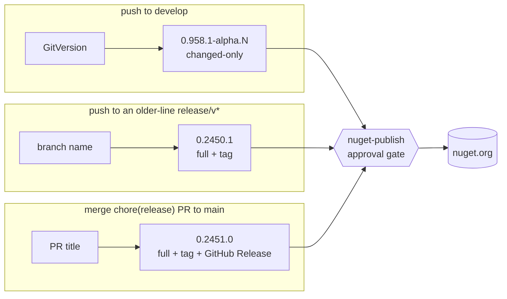
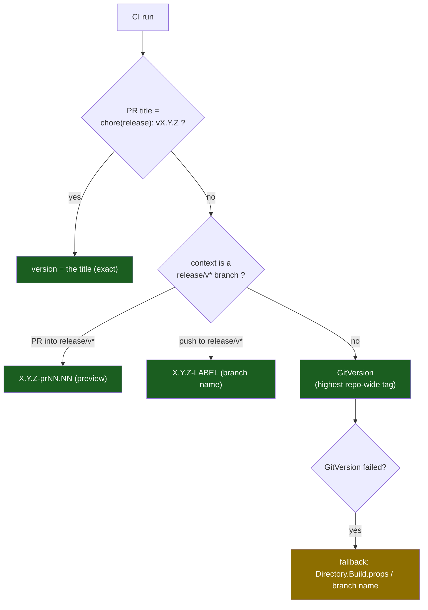
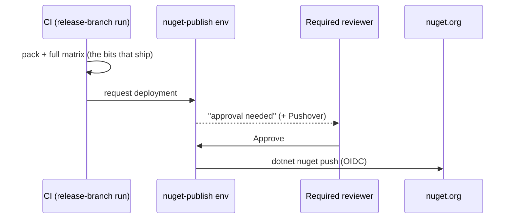

# Releasing & Versioning

> **Audience:** both humans and AI sessions. This is the single source of truth for how Whizbang
> decides a version, publishes packages, and keeps GitVersion in lock-step. If you touch anything in
> `.github/workflows/*version*`, `release.yml`, `start-release.yml`, `ci.yml`, or `nuget-*.yml`,
> update this document in the same PR.

## TL;DR

- **One number, everywhere.** The version that is *printed* (PR preview) equals what is *published*
  to nuget.org, *stamped* into the assemblies/`.nupkg` (`dotnet pack -p:Version=…`), and *tagged* in
  git (`vX.Y.Z`). These can never legitimately diverge — if they do, it's a bug.
- **The git tag is the source of truth for "what version are we at."** GitVersion derives the next
  version from the **highest repo-wide tag**, so every release must create a matching tag (they do).
- **`Directory.Build.props` is a *local dev placeholder*, not the source of truth.** The pipeline
  stamps the real version at build time; it never reads the version *from* that file (except as a
  last-ditch fallback if GitVersion itself fails).
- **Publishing to nuget.org is gated behind your approval** (the `nuget-publish` GitHub Environment).
  Nothing reaches nuget.org until a required reviewer approves — unless the repository variable
  `PUBLISH_WITHOUT_APPROVAL` is set to `true`, which stands the gate down until it is unset.

---

## Branching model (gitflow)

| Branch | Purpose | Publishes | Merges to |
|---|---|---|---|
| `feature/*`, `fix/*` | day-to-day work | nothing (PR CI only) | `develop` (via PR) |
| `develop` | integration line | **alpha prereleases** (changed-only) | — (release branches cut from here) |
| `release/vX.Y.Z[-label]` | prepare a release | optional prerelease on push | `main` (via the release PR) |
| `main` | released history | the **final** version on merge | — (tags live here) |

The `release` branch below is `release/vX.Y.Z` in practice; simplified here for the diagram.


**Key nuance — `main` and `develop` deliberately diverge.** The release branch carries a version bump
in `Directory.Build.props` (e.g. `0.958.0`) that is **not** merged back into develop — develop keeps
its local placeholder (`0.100.0-local.NNN`). This is intentional and does **not** affect versioning
(see [GitVersion synchronization](#gitversion-synchronization--why-it-still-works)). The post-release
`Sync Main to Develop` job therefore does nothing in the common case (see [that section](#sync-main--develop)).

---

## The three publish channels

There is exactly one place packages are pushed to nuget.org (`nuget-push.yml`, gated on the
`nuget-publish` environment), but three ways to *reach* it:

| Channel | Trigger | Version comes from | Completeness | Creates a git tag? | Example |
|---|---|---|---|---|---|
| **Develop alpha** | push/merge to `develop` | GitVersion (`highest tag` + Minor + `alpha` + height) | **changed-only** (partial) | no | `0.2451.0-alpha.75` |
| **Release-branch** | push to an existing **older-line** `release/v*` with no PR into `main` (non-creation); see [Hotfixes](#hotfixes) | the **branch name** | full (all packages) | yes | `0.2450.1` |
| **Release (final)** | merge a `chore(release): vX.Y.Z` PR into `main` | the **PR title** | full (all packages) | yes | `0.2451.0` / `0.2451.0-beta.1` |

> ⚠️ **Changed-only caveat.** Develop alphas republish *only the packages whose content changed* and
> stamp lockstep inter-package dependency requirements, so a given `alpha.N` can be a partial,
> **unconsumable** version set. For anything a consumer will restore, use a **full**
> publish — a release-branch push or a release (final) — which always publishes all packages.



---

## How the version is decided

`reusable-version.yml` resolves the version with a strict priority. The **first** match wins:



- **Release-PR title override** (top priority) exists so the **preview comment equals what publishes.**
  A release PR (`chore(release): vX.Y.Z` into `main`) publishes exactly the title version on merge —
  `release.yml` reads that same title — so the preview must show it verbatim (no GitVersion, no `-pr`
  suffix). Keyed on the *title* (not the branch name) so an edited title still previews correctly.

> [!WARNING]
> **The release PR title IS the version string — nothing may follow it.** "Exactly the title version"
> is literal: everything after `chore(release): v` is taken as the version, including any descriptive
> suffix. A title like `chore(release): v0.1024.0 — reconcile the divergence` yields
> `RELEASE_VERSION=0.1024.0 — reconcile the divergence`, and **Create Release** dies at
> `git tag` with `is not a valid tag name` (exit 128). Build/Pack, Publish and Upload then *skip*, so
> nothing is half-published — but nothing ships, and the failure is at the very end of the pipeline.
> Put the description in the PR body, never the title.
>
> Prefer **`/release [major|minor|patch|auto]`**, which dispatches `release.yml` via
> `workflow_dispatch` and bypasses title parsing entirely. To recover from a bad title, re-dispatch
> rather than re-titling and re-merging:
> `gh workflow run release.yml --ref main -f version=X.Y.Z -f release_type=auto -f dry_run=false`
> — note **`dry_run` defaults to `true`**, so omitting it is a silent no-op that reports success.
- **Release-branch override** covers pushes to / PRs into a `release/v*` branch, where the branch name
  is the deterministic version source (GitVersion would otherwise pick the highest *repo-wide* line,
  which is wrong on an old-line hotfix branch).
- **GitVersion** handles everything else (feature PRs, develop) — see below.
- **Fallback** only fires if GitVersion itself errors.

**The resolved version is then used identically for publish, stamp, and tag** — that's the invariant:

```
resolved version ──► dotnet pack -p:Version="$VERSION"   (stamps assemblies + .nupkg)
                 ├──► dotnet nuget push                    (publishes that exact version)
                 └──► git tag -a "v$VERSION"               (records it for GitVersion)
```

---

## Version increment rules

**Every release is at least a MINOR bump. The patch band is reserved for hotfix/bugfix-only
releases.** This is a hard rule, and the branch configuration enforces it automatically:

| Channel | Band | Who picks the number |
|---|---|---|
| develop pushes (auto prerelease) | **next-minor**: `0.(Y+1).0-alpha.N` above the last tag | GitVersion (`develop: increment: Minor`), `N` = commit height |
| Deliberate release (`start-release`) | **minor**: `0.(Y+1).0[-beta.N\|-rc.N]` | `release_type: auto` (GitVersion already computes the next minor), plus `prerelease_label` |
| Hotfix / bugfix-only | **patch**: `0.Y.Z` on an existing release line | The `release/vX.Y.Z` **branch name** (branch-name override, not GitVersion) |

**Why the rule exists (learned the hard way, 2026-07):** the develop channel auto-publishes
prereleases with GitVersion-computed heights (`-alpha.N`). A deliberate release cut into the
*same* band uses its own numbering (`-alpha.1`) and can land **below** already-published
develop builds — `0.959.1-alpha.1` sorted under the pre-existing `0.959.1-alpha.12`, making
the "new" release invisible to latest-version resolution. Disjoint bands make that collision
impossible: develop always computes one minor above the last release tag, a deliberate release
crystallizes a fresh minor band, and hotfixes patch old lines by branch name without touching
either.

Disjoint **labels** close the same hole structurally: `alpha` belongs to the develop channel alone,
and a deliberate cut uses `beta`, `rc` or no label (`prerelease_label` offers nothing else). Within
one number, precedence then falls out on its own:

```
0.Y.0-alpha.N  <  0.Y.0-beta.1  <  0.Y.0-rc.1  <  0.Y.0
```

Rules of thumb:
- Cut with **`release_type: auto`**. For a prerelease, choose `prerelease_label`, never `manual`,
  which is **recovery-only**. If you do recover with `manual`, pick the **next minor** band and a
  label other than `alpha`.
- Hotfixes: see [Hotfixes](#hotfixes). The branch name versions them, and where they merge back
  depends on whether they patch the current line or an older one.
- The develop channel takes care of itself — after any release tag, its next build computes in
  the following minor band automatically.

---

## GitVersion synchronization — why it still works

**GitVersion here derives the base version from the highest tag *repo-wide*, not by branch ancestry.**
This is load-bearing and easy to get wrong, so it's worth proving:

- The highest tag is `v0.2450.0`, and it is **not** reachable by ancestry from `develop` (it lives on
  the main-side merge commit, which is never merged back — see [branching](#branching-model-gitflow)).
- Yet develop computes `0.2451.0-alpha.75` (GitVersion 6.2 with this repo's `GitVersion.yml`).

The only way `0.2451.0` can appear is GitVersion taking `v0.2450.0` (the highest tag anywhere in the
repo) and applying develop's `increment: Minor` + `label: alpha` + commit height. A prerelease tag
counts too: with `v0.2451.0-beta.1` as the highest tag, develop computes `0.2452.0-alpha.N`, even
before the release syncs back to develop, and so does `start-release` with `release_type: auto`.
That is why an open beta/rc series pins its number (see [Prerelease series](#prerelease-series)).
So:


**Consequences:**
- Every release **must** create a tag (it does — `release.yml` and `nuget-publish.yml` both tag).
  Develop alphas intentionally don't tag; they derive from the base tag + height.
- A **manual/override** version is still reflected, because it is what gets tagged.
- `release.yml` **fails if the tag already exists** — you can never re-publish a version, and the
  tag history can never silently disagree with GitVersion.
- A **lower** version (a backport tag `< highest`) will not advance the mainline base — correct.

---

## The approval gate

The `push` job in `nuget-push.yml` declares `environment: nuget-publish`, which has a **required
reviewer**. Every publish path funnels through it, so **nothing reaches nuget.org without an approval**
in the GitHub Actions UI. (`release-approval`, used by release.yml's "Approve Release" job, has no
rules today and auto-passes — the real gate is `nuget-publish`.)

### Standing the gate down

Set the repository variable **`PUBLISH_WITHOUT_APPROVAL`** to `true` and every publish goes straight
out, for as long as it stays set. Unset it to put the gate back. Nothing else changes: same job, same
packages, same attestation.

It works by choosing the environment rather than by skipping the wait, because the wait belongs to
the environment and a job cannot ask to be reviewed conditionally:

| `PUBLISH_WITHOUT_APPROVAL` | environment | behavior |
|---|---|---|
| unset, or anything but `true` | `nuget-publish` | waits for a required reviewer |
| `true` | `nuget-publish-auto` | publishes unattended |

Two things to do before the first time you set it:

1. **Create the `nuget-publish-auto` environment** with no protection rules. A publish that names an
   environment which does not exist does not fall back to the protected one.
2. **Give nuget.org a trusted-publishing policy that accepts it.** The OIDC token carries the
   environment name, so a policy naming `nuget-publish` rejects a token minted under
   `nuget-publish-auto` with a policy mismatch. Either add a second policy or drop the environment
   from the existing one. This fails at the push, after the packages are built, attested and
   uploaded — not at the gate.

A run that published without review says so in its job summary, so the two cases do not read alike
afterwards.



---

## CI skips redundant matrices (queue-validated + ff-validated + release-pr)

Every merge used to run the full test matrix **three** times — the PR run, the merge-queue run,
and the post-merge develop push run, and every release cut ran it twice over one commit. Three
guards in `ci.yml` remove the redundant legs while keeping every publish gate provable. A
fast-forward merge now runs the matrix **once** (the PR run); a real merge (develop moved) runs it
**twice** (PR + queue); a release cut runs it **once** (the release-branch push run).

### ff-validated — skip the redundant *queue* matrix on a fast-forward

When a single PR's branch already contains the current develop tip, the merge queue's
prospective-merge commit has a tree **byte-identical** to what the PR run already tested in full.
`ff-validated` (merge_group runs only) detects this and skips the six suites and quality in the
queue run:

- It reads the queue commit's parents: exactly two (base + one PR head) means a single-PR group;
  more means a batch, which the PR runs never tested as-merged → full matrix.
- It requires the queue commit's **tree** to equal the PR head's tree (the merge added nothing —
  a true fast-forward). develop is append-only, so an identical tree proves the PR run's own
  test-merge was this exact tree.
- It requires the PR run for that head to have gone fully green **including Quality**, so a
  dependabot PR (whose Quality is skipped) still gets a real queue run.
- Any uncertainty — batched group, moved develop, missing or non-green PR run — falls through to
  the full queue matrix. The queue **Build** always runs, so the determinism manifest exists for
  the push run's verify-rebuild.

Escape hatch: repo variable `QUEUE_RUN_FULL_MATRIX=true` forces the full queue matrix.

### queue-validated — skip the redundant *push* matrix

The merge queue fast-forwards develop to the **exact SHA** it just ran (whether that queue run was
full or ff-skipped), so the post-merge push run used to re-test identical bytes for ~35-40 minutes
before the alpha could publish. `ci.yml` short-circuits that redundancy while keeping the publish
gate provable:

- **queue-validated** (develop pushes only) looks for a successful `merge_group` CI run on the
  pushed SHA. Found ⇒ the six suites and quality skip in the push run.
- **verify-rebuild** replaces them on the publish path: it requires the queue run's exact SDK
  and rebuilds at the queue's placeholder version, then confirms the built **assembly set**
  matches the queue run's determinism manifest (`reusable-build.yml` uploads one on every run).
  Same commit SHA + same SDK + same assembly set is the safety argument — identical source on an
  identical toolchain behaves like what the suites tested. Byte-for-byte hash identity is
  reported for monitoring but is **not** a gate: source generators emit nondeterministically for
  an unpredictable subset of assemblies (`[LoggerMessage]` partial-class ordering, ILRepack
  MVIDs), so a hash comparison flakes and a name allowlist can never be complete. Tamper-evidence
  for the published bits is the SLSA provenance attestation, not this rebuild.
- **reupload-reports** republishes the full-matrix run's coverage and TRX artifacts into the push
  run, so the Codecov develop baseline, Test Analytics uploads, and the docs test-status
  publication keep flowing exactly as before. Its source is the queue run — **except** on a
  fast-forward merge, where the queue run itself ff-skipped its suites and holds no reports; there
  it falls back to the PR run (the push merge commit's second parent is the PR head) that actually
  ran the full matrix.

`prerelease-publish` accepts either gate: every suite green **in this run** (the old invariant,
still the path whenever queue validation is absent — a standalone push, an expired queue run,
the escape hatch), or **queue-validated + verify-rebuild green**.

**Escape hatch:** set the repo variable `PUSH_RUN_FULL_MATRIX=true` and re-run **all jobs** on
the push run to force the full matrix. That is the remedy when verify-rebuild refuses a
toolchain drift (e.g. an SDK patch released in the minutes between the queue run and the push
run) — the publish stays blocked until either the drifted rebuild is validated by real suites or
the next merge lands.

### release-pr — skip the redundant *release PR* matrix

`start-release` pushes `release/vX.Y.Z` **and** opens the release PR at the same commit, so two CI
runs cover identical bytes. The push run must run everything, because only it can publish; the PR
run only gates the merge. `release-pr` (release PRs only) makes the PR run yield **format, build,
quality and the six suites** to the push run when one exists for the PR head. The required checks on
`main` are then satisfied by the push run's results, which carry the same check names on the same
commit.

- It yields only to a push run that can still report green. One already **canceled or failed** keeps
  the matrix in the PR run instead.
- Each yield posts one **sticky PR comment** naming the push run. If that run is later canceled or
  fails, the PR blocks with no failing check of its own, and the comment is where the recovery
  lives: **re-run the push run** (`gh run rerun <id> --failed`). Its fresh results land on the same
  commit.

**Escape hatch:** repo variable `RELEASE_PR_FULL_MATRIX=true`, then re-run the PR's CI run, forces
the full matrix in the PR run. Unset it afterwards.

---

## `Directory.Build.props`

- On `develop` it holds a **local placeholder** like `<Version>0.100.0-local.111</Version>`.
- The **pipeline stamps** the real version at build time (`-p:Version=…`); it does **not** read the
  version from this file — the flow is "gitflow decides the version → pipeline stamps it", *not* the
  other way around.
- `start-release` writes the chosen version into it on the release branch so local builds of that
  branch match; that commit stays on the release branch / `main` and is **not** synced into develop.
- Only edit it for **local** development, and only with a `-local.*`-suffixed value.

---

## Sync Main → Develop

After a release publishes, the `sync-develop` job reconciles main into develop **via a PR, never a
direct push** (develop is protected). The mechanism lives in `reusable-sync-develop.yml` and has two
callers: `release.yml` after a merge to main (source: `main`), and `ci.yml` after an older-line
hotfix publishes (source: the hotfix commit, which never reaches main; see [Hotfixes](#hotfixes)).

- It compares main and develop with a **three-dot diff** (`origin/develop...origin/main`) so it only
  considers what the *release* added, not develop's own post-cut progress.
- If the only difference is the `Directory.Build.props` version bump (the common case), it **skips** —
  develop keeps its local placeholder, and versioning doesn't need the bump (GitVersion uses the tag).
- If main has *real* release-stabilization changes develop lacks, it opens a **review PR** into
  develop with `Directory.Build.props` restored to develop's value.

---

## Cutting a release — step by step

Use `start-release` (Actions → **Start Release** → *Run workflow*, from `develop`):

| `release_type` | Version | When |
|---|---|---|
| `auto` | GitVersion's number (already the next minor), or the open series' number; see [Prerelease series](#prerelease-series) | **every normal release** |
| `major` | GitVersion base, major bump | breaking release |
| `minor` / `patch` | GitVersion base, bumped once more | rarely: `auto` already lands in the next minor band |
| `manual` + `manual_version` | exactly what you type | **recovery only** |

`prerelease_label` (`none`, `beta`, `rc`) adds a label to any type except `manual`. The iteration
number is automatic: the next `beta.N` after the highest one tagged for that number.

It creates `release/vX.Y.Z[-label]`, **merges `main` into it** (so the PR is conflict-free — see
below), writes the version into `Directory.Build.props`, and opens a PR to `main` titled
`chore(release): vX.Y.Z[-label]`. Then:

1. **Review the PR.** The version-preview comment now shows the exact version that will publish.
2. **Merge it.** `release.yml` runs: finds the release-branch run's **tested packages**, creates the
   tag, and requests the `nuget-publish` approval. See [Releases promote the tested packages](#releases-promote-the-tested-packages).
3. **Approve** in the Actions UI → packages publish to nuget.org.

> **Why start-release merges main first.** `main` carries the *previous* release's version in
> `Directory.Build.props` while `develop` keeps its local placeholder, so the two have diverged
> (`main` is not an ancestor of `develop`). Without reconciling, **every** release PR would conflict on
> that one line. `start-release` merges `main` into the fresh release branch and resolves that single
> expected conflict (the version is re-stamped immediately after), so the PR to `main` opens clean —
> without ever touching develop's placeholder. Any *other* merge conflict is unexpected and fails the
> run loudly rather than being silently dropped.

### Releases promote the tested packages

`release.yml` never rebuilds. The release-branch push run already packed every package at the release
version (from the branch name) and ran the full matrix against exactly those bytes, so the release
publishes that run's `nuget-packages-<run>` artifact as-is. `locate-tested-packages` runs **before
anything is tagged** and fails closed if any of these does not hold:

- HEAD's tree is byte-identical to the tested release-branch tree (true for every release merge,
  because `start-release` merges main into the release branch first);
- that release-branch run is green;
- its package artifact still exists (kept 7 days on a `release/v*` run).

Each package must then carry exactly the release version, so a PR title that disagrees with its
branch name fails instead of shipping a mismatch. A failure leaves no tag and no draft release behind.
Recovery, named in the error: re-run the release-branch CI run (all jobs), which rebuilds and
re-tests the packages, then
`gh workflow run release.yml --ref main -f version=X.Y.Z -f release_type=auto -f dry_run=false`.
It never falls back to a rebuild: that would publish bytes no suite ran against.

### Prerelease vs final

- A version **with** a label (`-beta.1`, `-rc.1`) publishes as a **GitHub Pre-Release**
  (the "Create GitHub Pre-Release" step fires because the version contains `-`) and marks the nuget
  package as a prerelease. Use it to give consumers a **complete, consumable** build to validate.
- A version **without** a label is a **stable** release. The stable tag (`v0.2451.0`) is distinct
  from any prerelease tag (`v0.2451.0-beta.1`), so promoting to stable never collides.

### Prerelease series

**A series pins its number once opened.** The first labeled cut takes its number from GitVersion.
Once `v0.2451.0-beta.1` is tagged, GitVersion moves on to `0.2452.0` (verified above), so without a
rule every later cut would drift upward and the number that was betaed could never ship. An **open
series** is the highest `X.Y.Z` that has `beta`/`rc` tags, no stable tag, and sits above the highest
stable release. With `release_type: auto`, `start-release` continues it:

| Tags so far | `prerelease_label` | Cut |
|---|---|---|
| (none for `0.2451.0`) | `beta` | `0.2451.0-beta.1` |
| `-beta.1` | `beta` | `0.2451.0-beta.2` |
| `-beta.1`, `-beta.2` | `rc` | `0.2451.0-rc.1` |
| `-rc.1` | `beta` | **refused**: a beta would sort below the rc already shipped |
| `-rc.1` | `none` | `0.2451.0` (the promotion) |
| `0.2451.0` | `none` | `0.2452.0` (series closed; GitVersion again) |

`major`, `minor` and `patch` start a new number instead and warn that the open series is left
unpromoted. Old `-alpha.N` cut tags from before this rule never count as a series.

---

## Hotfixes

A **bugfix** branches from `develop`, merges through an ordinary PR, and ships in the next release:
nothing special. A **hotfix** ships out of band on a `release/vX.Y.Z` branch cut by hand from the line
it patches:

1. Branch from the tag of the line it patches (`git switch -c release/v0.2450.1 v0.2450.0`) and push
   the branch **before** the fix. The creation push is ignored.
2. Commit the fix and push.

The push run's `release-guard` then decides by **line**, comparing the branch version with the
highest stable tag:

| Line | Example (highest stable `0.2451.0`) | What happens |
|---|---|---|
| **Current** (above it) | `release/v0.2451.1` | The guard **opens the release PR into `main`** (title `chore(release): v0.2451.1`) instead of publishing. Merging it publishes through `release.yml` and syncs develop, exactly like a release cut. |
| **Older** (at or below it) | `release/v0.2450.1` | Publishes from the push (after the approval gate), then opens a **develop-only** back-merge PR. It never touches `main`, which would regress main to an older release. |

Either way the fix reaches develop, so the next cut from develop cannot silently ship without it. The
back-merge PR may conflict when the lines have diverged; resolve it like any PR.

---

## Gotchas & invariants (for future edits)

- **Never** make the printed/preview version differ from what publishes. If you change one version
  source, check all three consumers (pack stamp, nuget push, git tag) still agree.
- **Never** push directly to `develop` or `main` — both are protected; use a PR. Automated jobs that
  need to reach a protected branch must open a PR (see `sync-develop`).
- **Concurrency:** the CI concurrency group includes `github.event_name` so a release **PR** run can
  never cancel the release-branch **push** run (a publish must never be canceled mid-push). Don't
  collapse them back into one group — that reintroduces the spurious canceled-`CI Result` that
  blocks release merges.
- **Required status checks** on `main`/`develop` must match the *current* CI job names. If you rename
  a job (e.g. split "Service Bus Integration" into `(whizbang)`/`(ecommerce)`), update the branch
  ruleset's required checks or every merge wedges on a phantom "expected" check.
- **Tags are forever.** Because GitVersion keys on the highest repo-wide tag, a stray high tag
  (e.g. an accidental `v9.9.9`) will hijack every subsequent version. Delete mistaken tags promptly.
- **The develop-push matrix skip is SHA-keyed and fails closed.** `queue-validated` skips the
  suites only when a successful `merge_group` CI run exists for the *exact* pushed SHA, and the
  publish then additionally requires `verify-rebuild`'s same-SDK + same-assembly-set check.
  Anything else — a direct push, an expired queue run, SDK drift, a changed assembly set,
  `PUSH_RUN_FULL_MATRIX=true` — falls back to the full matrix or blocks the publish. Never widen
  the match beyond the exact SHA. Do NOT reintroduce a byte-identity hash gate: generator
  nondeterminism makes it flake (it blocked a publish once, #691); the SLSA provenance
  attestation is the tamper-evidence on the published bits.
- **The fast-forward queue skip is tree-keyed and fails safe.** `ff-validated` skips the queue
  suites only for a single-PR group whose merge tree is byte-identical to a fully-green (incl.
  Quality) PR run's tree. Every uncertain path emits `skip=false` (full queue matrix) and the job
  never fails the run. Never loosen the single-PR / identical-tree / PR-run-green trio — those
  three together are what make trusting the PR run in place of the queue run sound; the queue
  **Build** must keep running unconditionally so verify-rebuild still has a manifest.
- **Two publish paths don't compete.** A push to a `release/v*` branch can publish via
  `ci.yml`'s `release-publish`, and the merge to main publishes via `release.yml` — both would target
  the same version+tag. The `release-guard` job skips `release-publish` whenever the branch has an
  **open PR into main** (the merge will publish), so a conflict fix or stabilization push to a release
  branch never spawns a competing approval-gate deployment. Only older-line hotfix branches publish on
  push; a current-line one gets a PR instead (see [Hotfixes](#hotfixes)).
- **GitHub applies `success()` to a job implicitly, unless its `if` contains a status-check
  function.** Most jobs in `ci.yml` open with `!failure() && !cancelled()` so a skipped need does not
  poison them, which also removes the implicit gate. Both publish jobs (`prerelease-publish`,
  `release-publish`) therefore **name every result they depend on**. Never collapse those back into
  an implicit gate: adding a status-check function to a plain `if` silently deletes the whole test
  gate.
- **Address workflow runs by path, never by `.name`.** `ci.yml` sets a `run-name` (a `release/v*`
  push is a "release cut", a develop push "post-merge"), so no run is named plain "CI". Look runs up
  with `repos/$REPO/actions/workflows/ci.yml/runs?...`; filtering on `.name` silently matches
  nothing, and has broken two gates.
- **Quality derives its coverage count.** It waits for one `coverage-*` artifact per suite leg,
  counting legs from the jobs list once Build succeeds. Suite legs must stay named
  `<suite> / <...> Tests`; a finished-green set with a missing artifact fails loudly. Its job budget
  (180 minutes) is sized for runner queueing, because it starts with the run and waits.
- **`main` is protected by a ruleset, not classic branch protection.** `.../branches/main/protection`
  returns 404 "Branch not protected"; the 13 required checks are at
  `gh api repos/<owner>/<repo>/rules/branches/main`.
