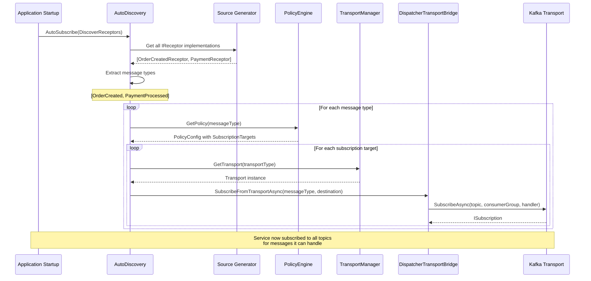
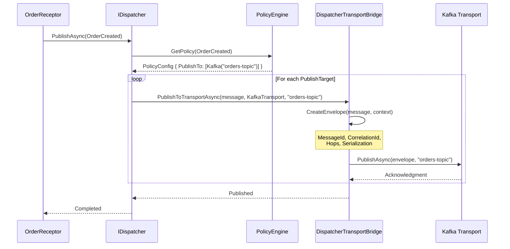
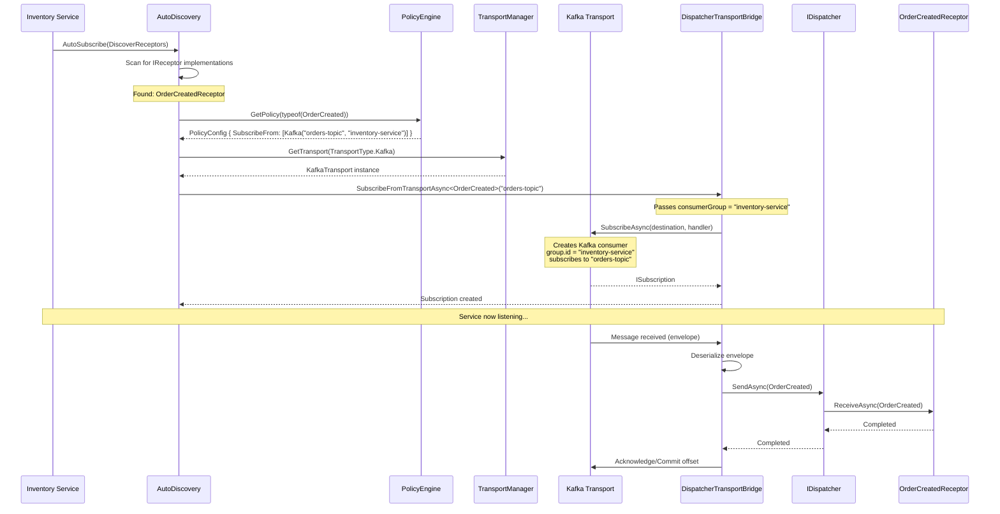
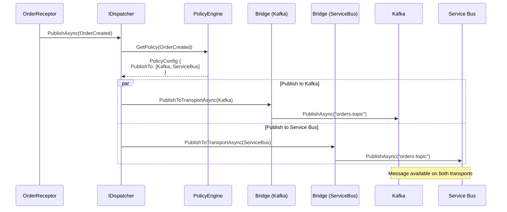

# Transport Routing Architecture

**Status**: Design Document
**Version**: v0.3.0 (Proposed)
**Last Updated**: 2025-11-08
**Owner**: Phil Carbone

---

## Executive Summary

This document defines the **policy-based transport routing architecture** for Whizbang. It describes how services:
- **Publish** messages to remote transports (Kafka, Service Bus, RabbitMQ)
- **Subscribe** to remote transports based on local receptors
- Handle **consumer groups** (Kafka) and **topic subscriptions** (Service Bus)
- Enable **auto-discovery** with zero manual subscription management

**Key Principle**: Policies define routing. Services declare what they publish and subscribe to. Whizbang handles the rest.

---

## Table of Contents

1. [Architecture Overview](#architecture-overview)
2. [Policy-Based Routing](#policy-based-routing)
3. [Transport Models](#transport-models)
4. [Auto-Discovery](#auto-discovery)
5. [Complete Examples](#complete-examples)
6. [Sequence Diagrams](#sequence-diagrams)
7. [API Reference](#api-reference)

---

## Architecture Overview

### The Key Insight: Local vs Remote Policies

Each service has **its own local policies** that define:
- **Publishing (Outbound)**: Where messages are published when created locally
- **Subscribing (Inbound)**: Where to listen for messages this service can handle

```
┌─────────────────┐                    ┌─────────────────┐
│  Order Service  │                    │ Inventory Svc   │
├─────────────────┤                    ├─────────────────┤
│ Policy:         │                    │ Policy:         │
│ OrderCreated    │                    │ OrderCreated    │
│  → Publish to   │   Kafka Topic:     │  ← Subscribe    │
│     "orders"    │   "orders-topic"   │     from        │
│                 │                    │     "orders"    │
└─────────────────┘                    └─────────────────┘
```

### Three-Layer Architecture

```
┌──────────────────────────────────────────────┐
│           Application Layer                  │
│  (Receptors, Commands, Events, Queries)      │
└──────────────────┬───────────────────────────┘
                   │
┌──────────────────▼───────────────────────────┐
│         Policy Engine Layer                  │
│  (Routing decisions, where to pub/sub)       │
└──────────────────┬───────────────────────────┘
                   │
┌──────────────────▼───────────────────────────┐
│      Transport Bridge Layer                  │
│  (DispatcherTransportBridge, serialization)  │
└──────────────────┬───────────────────────────┘
                   │
┌──────────────────▼───────────────────────────┐
│         Transport Layer                      │
│  (Kafka, ServiceBus, RabbitMQ, EventStore)   │
└──────────────────────────────────────────────┘
```

---

## Policy-Based Routing

### Publishing Configuration

Define **where messages are published** when created locally:

```csharp
// Order Service - Publisher
builder.Services.AddWhizbang(options => {
    options.Transports.AddKafka("localhost:9092");

    options.Policies.When(ctx => ctx.Message is OrderCreated)
        .Then(config => config
            .UseTopic("orders") // Logical topic
            .PublishToKafka("orders-topic") // Kafka topic
            .PublishToServiceBus("orders-topic") // ServiceBus topic (fan-out)
        );
});
```

**Multiple Transports**: Messages can be published to multiple transports simultaneously (fan-out).

### Subscription Configuration

Define **where to subscribe** for messages this service can handle:

```csharp
// Inventory Service - Subscriber
builder.Services.AddWhizbang(options => {
    options.Transports.AddKafka("localhost:9092");

    options.Policies.When(ctx => ctx.Message is OrderCreated)
        .Then(config => config
            .SubscribeFromKafka(
                topic: "orders-topic",
                consumerGroup: "inventory-service" // Load balancing
            )
        );

    // Auto-subscribe: discovers OrderCreatedReceptor, uses policy above
    options.Transports.AutoSubscribe(discovery => {
        discovery.DiscoverReceptors();
    });
});

// Local receptor handles incoming messages
public class OrderCreatedReceptor : IReceptor<OrderCreated> {
    public async Task ReceiveAsync(OrderCreated message) {
        await _inventory.ReserveAsync(message.Items);
    }
}
```

### Policy Resolution Flow

```
Message Created → Policy Matches → PublishTargets → Transport Bridge → Kafka/ServiceBus/etc.
                                                                     ↓
Message Arrives ← Dispatcher ← Bridge ← Transport ← Kafka/ServiceBus/etc.
                       ↓
                    Receptor
```

---

## Transport Models

Different transports have different subscription models. Whizbang abstracts these differences while exposing transport-specific configuration.

### Kafka: Topic + Consumer Group

**Model**: Topics have partitions. Consumer groups share partition load.

```csharp
.SubscribeFromKafka(
    topic: "orders-topic",
    consumerGroup: "inventory-service",
    partition: null // Auto-assigned by Kafka
)
```

**Behavior**:
- **Same consumer group** = Load balancing (one instance processes message)
- **Different consumer groups** = Fan-out (all groups get message)

**Scaling Example**:

```
Orders Topic (3 partitions)
├── Partition 0
├── Partition 1
└── Partition 2

Consumer Group: inventory-service
├── Instance 1 → Partitions [0, 1]
└── Instance 2 → Partition [2]

Consumer Group: shipping-service
├── Instance 1 → Partition [0]
├── Instance 2 → Partition [1]
└── Instance 3 → Partition [2]
```

Both `inventory-service` and `shipping-service` get **all messages** (different consumer groups). Within each group, instances **share the load** (partition assignment).

### Azure Service Bus: Topic + Subscription

**Model**: Topics have subscriptions. Each subscription gets a copy of the message.

```csharp
.SubscribeFromServiceBus(
    topic: "orders-topic",
    subscriptionName: "inventory-sub",
    sqlFilter: null // Optional SQL filter
)
```

**Behavior**:
- **Different subscriptions** = Fan-out (each subscription gets message)
- **Same subscription** = Load balancing (instances compete for message)

**Scaling Example**:

```
Orders Topic
├── Subscription: inventory-sub
│   ├── Instance 1 (competes)
│   └── Instance 2 (competes)
└── Subscription: shipping-sub
    ├── Instance 1 (competes)
    └── Instance 2 (competes)
```

Both `inventory-sub` and `shipping-sub` get **all messages** (different subscriptions). Within each subscription, instances **compete** (PeekLock ensures at-most-once processing).

**SQL Filters** (Optional):

```csharp
.SubscribeFromServiceBus(
    topic: "orders-topic",
    subscriptionName: "high-priority-orders",
    sqlFilter: "Priority > 5"
)
```

### RabbitMQ: Exchange + Queue + Routing Key

**Model**: Exchanges route to queues based on routing keys.

```csharp
.SubscribeFromRabbitMQ(
    exchange: "orders",
    queueName: "inventory-queue",
    routingKey: "order.created"
)
```

**Behavior**:
- **Different queues** = Fan-out (each queue gets message if routing key matches)
- **Same queue** = Load balancing (instances compete for message)

**Scaling Example**:

```
Exchange: orders (type: topic)
├── Queue: inventory-queue (routing: "order.created")
│   ├── Instance 1 (competes)
│   └── Instance 2 (competes)
└── Queue: shipping-queue (routing: "order.created")
    ├── Instance 1 (competes)
    └── Instance 2 (competes)
```

Both queues get messages matching `order.created` (different queues). Within each queue, instances **compete**.

### Infrastructure Mapping

| Whizbang Concept | Kafka | Service Bus | RabbitMQ |
|------------------|-------|-------------|----------|
| **Topic** | Topic | Topic | Exchange |
| **Subscription** | Consumer Group | Subscription | Queue |
| **Load Balancing** | Partition assignment | PeekLock competition | Message consumption |
| **Fan-Out** | Multiple consumer groups | Multiple subscriptions | Multiple queues |
| **Filtering** | Client-side | SQL filters | Routing keys |

---

## Auto-Discovery

### Discovery Modes

**1. Discover All Receptors** (Recommended)

```csharp
options.Transports.AutoSubscribe(discovery => {
    discovery.DiscoverReceptors(); // Scans for IReceptor<T>, subscribes based on policies
});
```

**2. Namespace Patterns**

```csharp
options.Transports.AutoSubscribe(discovery => {
    discovery.SubscribeToNamespace("MyApp.Orders.*");
    discovery.SubscribeToNamespace("MyApp.Payments.*");
    discovery.SubscribeToNamespace("*.Events");
});
```

**3. Explicit Types**

```csharp
options.Transports.AutoSubscribe(discovery => {
    discovery.Subscribe<OrderCreated>();
    discovery.Subscribe<PaymentProcessed>();
});
```

### Auto-Discovery Flow



### Namespace Pattern Matching

```csharp
// Pattern: "MyApp.Orders.*"
// Matches:
//   MyApp.Orders.OrderCreated ✓
//   MyApp.Orders.OrderUpdated ✓
//   MyApp.Orders.Commands.CreateOrder ✓
//   MyApp.Payments.PaymentProcessed ✗

// Pattern: "*.Events"
// Matches:
//   MyApp.Orders.Events.OrderCreated ✓
//   MyApp.Payments.Events.PaymentProcessed ✓
//   MyApp.Orders.OrderCreated ✗ (no ".Events" suffix)

// Pattern: "MyApp.*.*"
// Matches:
//   MyApp.Orders.OrderCreated ✓
//   MyApp.Payments.PaymentProcessed ✓
//   MyApp.OrderCreated ✗ (only one dot after MyApp)
```

---

## Complete Examples

### Example 1: Simple Kafka Fan-Out

**Order Service** (Publisher):

```csharp
builder.Services.AddWhizbang(options => {
    options.Transports.AddKafka("localhost:9092");

    options.Policies.When(ctx => ctx.Message is OrderCreated)
        .Then(config => config
            .PublishToKafka("orders-topic")
        );
});

// Somewhere in a receptor or command handler
await _dispatcher.PublishAsync(new OrderCreated { OrderId = "123", Items = [...] });
```

**Inventory Service** (Subscriber 1):

```csharp
builder.Services.AddWhizbang(options => {
    options.Transports.AddKafka("localhost:9092");

    options.Policies.When(ctx => ctx.Message is OrderCreated)
        .Then(config => config
            .SubscribeFromKafka("orders-topic", "inventory-service")
        );

    options.Transports.AutoSubscribe(discovery => {
        discovery.DiscoverReceptors();
    });
});

public class OrderCreatedReceptor : IReceptor<OrderCreated> {
    public async Task ReceiveAsync(OrderCreated message) {
        await _inventory.ReserveAsync(message.Items);
    }
}
```

**Shipping Service** (Subscriber 2):

```csharp
builder.Services.AddWhizbang(options => {
    options.Transports.AddKafka("localhost:9092");

    options.Policies.When(ctx => ctx.Message is OrderCreated)
        .Then(config => config
            .SubscribeFromKafka("orders-topic", "shipping-service") // Different group
        );

    options.Transports.AutoSubscribe(discovery => {
        discovery.DiscoverReceptors();
    });
});

public class OrderCreatedReceptor : IReceptor<OrderCreated> {
    public async Task ReceiveAsync(OrderCreated message) {
        await _shipping.PrepareShipmentAsync(message);
    }
}
```

**Result**: OrderCreated message delivered to **both** Inventory and Shipping services (different consumer groups = fan-out).

### Example 2: Multi-Transport Fan-Out

**Order Service** publishes to **both Kafka and Service Bus**:

```csharp
options.Policies.When(ctx => ctx.Message is OrderCreated)
    .Then(config => config
        .PublishToKafka("orders-topic")
        .PublishToServiceBus("orders-topic")
    );
```

**Inventory Service** subscribes from **Kafka**:

```csharp
options.Policies.When(ctx => ctx.Message is OrderCreated)
    .Then(config => config
        .SubscribeFromKafka("orders-topic", "inventory-service")
    );
```

**Analytics Service** subscribes from **Service Bus**:

```csharp
options.Policies.When(ctx => ctx.Message is OrderCreated)
    .Then(config => config
        .SubscribeFromServiceBus("orders-topic", "analytics-sub")
    );
```

**Result**: OrderCreated message delivered via **two independent transports** (Kafka → Inventory, ServiceBus → Analytics).

### Example 3: Service Bus with SQL Filters

**Order Service** publishes with metadata:

```csharp
var orderCreated = new OrderCreated {
    OrderId = "123",
    Priority = 10 // High priority
};

await _dispatcher.PublishAsync(orderCreated);
```

**Standard Processing**:

```csharp
options.Policies.When(ctx => ctx.Message is OrderCreated)
    .Then(config => config
        .SubscribeFromServiceBus("orders-topic", "standard-processing")
    );
```

**High-Priority Processing**:

```csharp
options.Policies.When(ctx => ctx.Message is OrderCreated)
    .Then(config => config
        .SubscribeFromServiceBus(
            topic: "orders-topic",
            subscriptionName: "high-priority-processing",
            sqlFilter: "Priority > 5" // SQL filter expression
        )
    );
```

**Result**: Standard processing gets **all orders**. High-priority processing gets **only orders with Priority > 5**.

### Example 4: Namespace-Based Auto-Discovery

**Multiple Message Types**:

```csharp
namespace MyApp.Orders.Events {
    public record OrderCreated;
    public record OrderShipped;
    public record OrderCancelled;
}

namespace MyApp.Payments.Events {
    public record PaymentReceived;
    public record RefundIssued;
}
```

**Service Configuration**:

```csharp
// Policies for all order events
options.Policies.When(ctx => ctx.MessageType.Namespace == "MyApp.Orders.Events")
    .Then(config => config
        .SubscribeFromKafka("orders-topic", "my-service")
    );

// Policies for all payment events
options.Policies.When(ctx => ctx.MessageType.Namespace == "MyApp.Payments.Events")
    .Then(config => config
        .SubscribeFromKafka("payments-topic", "my-service")
    );

// Auto-discover by namespace
options.Transports.AutoSubscribe(discovery => {
    discovery.SubscribeToNamespace("MyApp.Orders.Events.*");
    discovery.SubscribeToNamespace("MyApp.Payments.Events.*");
});
```

**Result**: Service automatically subscribes to **all event types** in those namespaces, even as new event types are added.

---

## Sequence Diagrams

### Publishing Flow (Kafka)



### Subscribing Flow (Kafka with Consumer Group)



### Multi-Transport Fan-Out



---

## API Reference

### PolicyConfiguration - Publishing

```csharp
public class PolicyConfiguration {
    // Publish to Kafka topic
    public PolicyConfiguration PublishToKafka(string topic);

    // Publish to Service Bus topic
    public PolicyConfiguration PublishToServiceBus(string topic);

    // Publish to RabbitMQ exchange with routing key
    public PolicyConfiguration PublishToRabbitMQ(string exchange, string routingKey);

    // Dynamic destination based on context
    public PolicyConfiguration PublishToKafka(Func<PolicyContext, string> topicSelector);
}
```

### PolicyConfiguration - Subscribing

```csharp
public class PolicyConfiguration {
    // Subscribe from Kafka topic with consumer group
    public PolicyConfiguration SubscribeFromKafka(
        string topic,
        string consumerGroup,
        int? partition = null // Optional: specific partition
    );

    // Subscribe from Service Bus topic with subscription name
    public PolicyConfiguration SubscribeFromServiceBus(
        string topic,
        string subscriptionName,
        string? sqlFilter = null // Optional: SQL filter expression
    );

    // Subscribe from RabbitMQ exchange with queue and routing key
    public PolicyConfiguration SubscribeFromRabbitMQ(
        string exchange,
        string queueName,
        string? routingKey = null
    );
}
```

### TransportAutoDiscovery

```csharp
public class TransportAutoDiscovery {
    // Discover all IReceptor implementations and subscribe
    public void DiscoverReceptors();

    // Subscribe based on namespace pattern
    // Patterns: "MyApp.Orders.*", "*.Events", "MyApp.*.*"
    public void SubscribeToNamespace(string pattern);

    // Explicitly subscribe to specific message type
    public void Subscribe<TMessage>();
}
```

### WhizbangOptions - Transport Setup

```csharp
public class WhizbangOptions {
    // Add Kafka transport
    public void AddKafka(string bootstrapServers);

    // Add Azure Service Bus transport
    public void AddServiceBus(string connectionString);

    // Add RabbitMQ transport
    public void AddRabbitMQ(string hostname, int port = 5672);

    // Configure auto-discovery
    public void AutoSubscribe(Action<TransportAutoDiscovery> configure);
}
```

### PublishTarget and SubscriptionTarget

```csharp
public record PublishTarget {
    public TransportType TransportType { get; init; }
    public string Destination { get; init; } // Topic/Queue/Exchange
    public string? RoutingKey { get; init; } // RabbitMQ routing key
}

public record SubscriptionTarget {
    public TransportType TransportType { get; init; }
    public string Topic { get; init; } // Kafka topic, ServiceBus topic, RabbitMQ exchange
    public string? ConsumerGroup { get; init; } // Kafka consumer group
    public string? SubscriptionName { get; init; } // ServiceBus subscription
    public string? QueueName { get; init; } // RabbitMQ queue
    public string? RoutingKey { get; init; } // RabbitMQ routing key
    public string? SqlFilter { get; init; } // ServiceBus SQL filter
    public int? Partition { get; init; } // Kafka partition (optional)
}

public enum TransportType {
    Kafka,
    ServiceBus,
    RabbitMQ,
    EventStore,
    InProcess
}
```

---

## Design Decisions

### Why Policy-Based Routing?

**Alternative 1: Convention-Based Routing**
```csharp
// Messages go to topic named after message type
OrderCreated → "OrderCreated" topic
```
❌ **Problem**: Inflexible, can't route to different topics per environment, can't fan-out to multiple transports.

**Alternative 2: Attribute-Based Routing**
```csharp
[PublishTo("orders-topic")]
public record OrderCreated;
```
❌ **Problem**: Couples message to transport, can't change routing at runtime, can't route differently per service.

**Alternative 3: Policy-Based Routing** (✅ Chosen)
```csharp
options.Policies.When(ctx => ctx.Message is OrderCreated)
    .Then(config => config.PublishToKafka("orders-topic"));
```
✅ **Benefits**:
- Decoupled: Messages don't know about transports
- Flexible: Different routing per service, environment, context
- Testable: Override policies in tests
- Multi-transport: Publish to multiple transports simultaneously
- Dynamic: Route based on message content, context, metadata

### Why Auto-Discovery?

**Without Auto-Discovery**:
```csharp
// Manual subscription management (error-prone)
await bridge.SubscribeFromTransportAsync<OrderCreated>(destination);
await bridge.SubscribeFromTransportAsync<OrderUpdated>(destination);
await bridge.SubscribeFromTransportAsync<OrderCancelled>(destination);
// Easy to forget one, hard to maintain
```

**With Auto-Discovery**:
```csharp
// Just write receptors, subscriptions happen automatically
options.Transports.AutoSubscribe(discovery => {
    discovery.DiscoverReceptors(); // Done!
});
```

✅ **Benefits**:
- Zero boilerplate
- Can't forget to subscribe
- Add receptor → subscription happens automatically
- Source generator provides compile-time safety
- Namespace patterns scale to dozens/hundreds of message types

### Why Consumer Groups / Subscriptions?

Different use cases require different delivery guarantees:

**Load Balancing** (Same consumer group/subscription):
- Multiple instances of same service
- Share partition/message load
- Horizontal scaling

**Fan-Out** (Different consumer groups/subscriptions):
- Multiple different services
- Each gets every message
- Event-driven architecture

Whizbang supports both via explicit configuration in policies.

---

## Future Enhancements

### v0.4.0: Dynamic Configuration

```csharp
// Reload policies at runtime
await _policyManager.ReloadPoliciesAsync();

// Add subscription dynamically
await _transportManager.AddSubscriptionAsync<NewEvent>(destination);
```

### v0.5.0: Transport Adapters

```csharp
// Custom transport implementations
options.Transports.AddCustom<MyKinesisTransport>(config => {
    config.StreamName = "my-stream";
});
```

### v0.6.0: Dead Letter Queues

```csharp
options.Policies.When(ctx => ctx.Message is OrderCreated)
    .Then(config => config
        .SubscribeFromKafka("orders-topic", "inventory-service")
        .WithDeadLetterQueue("orders-dlq")
        .WithRetryPolicy(maxRetries: 3, backoff: exponential)
    );
```

---

## Related Documentation

- [Transport Interfaces](./TRANSPORT-INTERFACES.md) - ITransport, ISubscription, IMessageSerializer
- [Dispatcher Transport Bridge](./DISPATCHER-TRANSPORT-BRIDGE.md) - Bridge implementation
- [Policy Engine](./v0.2.0-streams-policies-observability.md) - Policy evaluation
- [Infrastructure Mapping](./INFRASTRUCTURE-MAPPING.md) - Kafka, ServiceBus, RabbitMQ mapping

---

## References

- **Kafka Consumer Groups**: https://kafka.apache.org/documentation/#consumerconfigs_group.id
- **Service Bus Subscriptions**: https://learn.microsoft.com/en-us/azure/service-bus-messaging/service-bus-queues-topics-subscriptions#topics-and-subscriptions
- **RabbitMQ Exchanges**: https://www.rabbitmq.com/tutorials/amqp-concepts.html#exchanges
- **Policy Engine Design**: ../plans/v0.2.0-streams-policies-observability.md
