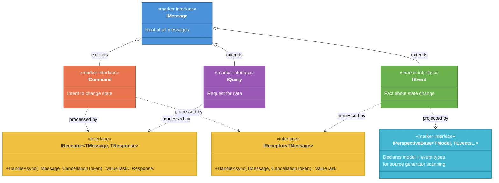

# Message Type Hierarchy

The foundation of Whizbang's type system. All messages implement `IMessage`, branching into three distinct intents: commands (change state), events (record facts), and queries (request data). Receptors handle messages with compile-time type safety and zero reflection.

## Key Concepts

| Type | Purpose | Handled By |
|------|---------|------------|
| `ICommand` | Express intent to change state | `IReceptor<TCommand, TResponse>` — validates rules, returns events |
| `IEvent` | Immutable fact about what happened | `IReceptor<TEvent>` — side effects (void) |
| `IQuery` | Request data without side effects | `IReceptor<TQuery, TResult>` — returns data |

### Receptor Patterns

- **`IReceptor<TMessage, TResponse>`** — Returns a typed result. Used for commands (returns events) and queries (returns data). Supports `LocalInvokeAsync` for in-process RPC.
- **`IReceptor<TMessage>`** — Zero-allocation void handler. Used for event side effects (notifications, cache busting, logging). Supports `PublishAsync` fire-and-forget.
- Both patterns are **AOT-compatible** — source generators create compile-time delegate invocations, never reflection.
