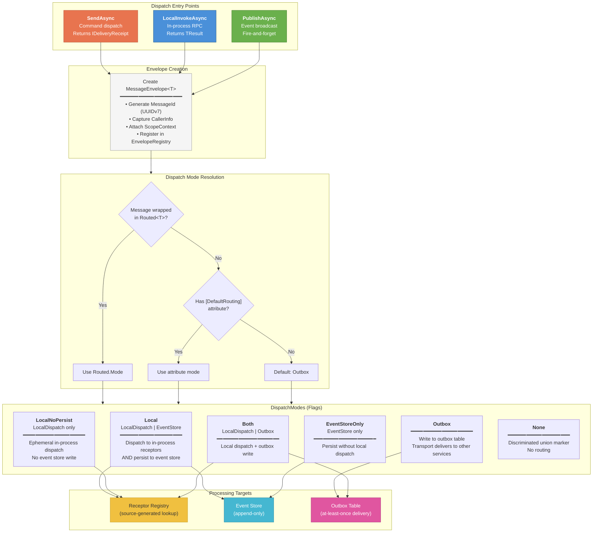

# Core Dispatch Flow

The Dispatcher is the central routing hub. It provides three distinct dispatch patterns, each with different semantics for how messages reach their receptors and what guarantees are provided.



## Dispatch Patterns

### SendAsync — Command Delivery
```
Caller → SendAsync(command) → Envelope → Route → Receptors/EventStore/Outbox
         Returns: IDeliveryReceipt (confirmation of dispatch, not processing)
```

### LocalInvokeAsync — In-Process RPC
```
Caller → LocalInvokeAsync<TMsg, TResult>(msg) → Envelope → Receptor → TResult
         Returns: Business result directly (zero-allocation ValueTask)
         Variant: LocalInvokeAndSyncAsync — waits for all perspectives to catch up
```

### PublishAsync — Event Broadcast
```
Caller → PublishAsync(event) → Envelope → All registered receptors
         Returns: IDeliveryReceipt (fire-and-forget semantics)
```

## Route Factory

```csharp
// Explicit routing wrappers
Route.Local(event)          // In-process + event store
Route.LocalNoPersist(event) // In-process only (ephemeral)
Route.Outbox(event)         // Cross-service delivery
Route.Both(event)           // In-process + outbox
Route.EventStoreOnly(event) // Persistence only
Route.None()                // Discriminated union marker
```

## Event Cascading

When a receptor returns messages, the `IEventCascader` determines routing:

1. Check if message is wrapped in `Routed<T>` → use explicit mode
2. Check message's `[DefaultRouting]` attribute → use attribute mode
3. Check receptor's `[DefaultRouting]` attribute → use receptor default
4. Fall back to system default → **Outbox**
