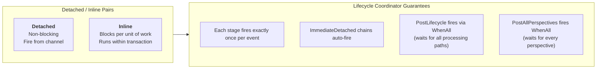

# Lifecycle Stages Pipeline

Whizbang defines **24 lifecycle stages** that control precisely when receptors execute relative to database operations and message processing. Stages are organized in **Detached** (fire-and-forget, own scope) and **Inline** (blocks worker) pairs across four processing workers.

```mermaid
flowchart TB
    subgraph Dispatcher["🔵 Dispatcher (Origin Service)"]
        direction TB
        IA["<b>ImmediateDetached</b><br/>Fire from dispatcher channel"]
        LIA["<b>LocalImmediateDetached</b><br/>Local dispatch, async"]
        LII["<b>LocalImmediateInline</b><br/>Local dispatch, blocking"]

        IA --> LIA --> LII
    end

    subgraph Distribute["🟡 Distribute Phase (Work Batch)"]
        direction TB
        PrDA["<b>PreDistributeDetached</b>"]
        PrDI["<b>PreDistributeInline</b>"]
        DA["<b>DistributeDetached</b><br/>Parallel with process_work_batch"]
        PoDA["<b>PostDistributeDetached</b>"]
        PoDI["<b>PostDistributeInline</b>"]

        PrDA --> PrDI --> DA --> PoDA --> PoDI
    end

    subgraph OutboxWorker["🟠 Outbox Worker (Sender Side)"]
        direction TB
        PrOA["<b>PreOutboxDetached</b><br/>Before transport publish"]
        PrOI["<b>PreOutboxInline</b>"]
        PoOA["<b>PostOutboxDetached</b><br/>After transport publish"]
        PoOI["<b>PostOutboxInline</b>"]

        PrOA --> PrOI --> PoOA --> PoOI
    end

    subgraph InboxWorker["🔴 Transport Consumer (Receiver Side)"]
        direction TB
        PrInA["<b>PreInboxDetached</b><br/>Before receptor processing"]
        PrInI["<b>PreInboxInline</b>"]
        PoInA["<b>PostInboxDetached</b><br/>After receptor processing"]
        PoInI["<b>PostInboxInline</b>"]

        PrInA --> PrInI --> PoInA --> PoInI
    end

    subgraph PerspectiveWorker["🟢 Perspective Worker (Read Models)"]
        direction TB
        PrPA["<b>PrePerspectiveDetached</b><br/>Before checkpoint update"]
        PrPI["<b>PrePerspectiveInline</b>"]
        PoPA["<b>PostPerspectiveDetached</b><br/>After checkpoint update"]
        PoPI["<b>PostPerspectiveInline</b>"]
        PAPA["<b>PostAllPerspectivesDetached</b><br/>After ALL perspectives (WhenAll)"]
        PAPI["<b>PostAllPerspectivesInline</b>"]

        PrPA --> PrPI --> PoPA --> PoPI --> PAPA --> PAPI
    end

    subgraph Final["⚫ Final Lifecycle"]
        direction TB
        PLA["<b>PostLifecycleDetached</b><br/>Once per event, after all paths"]
        PLI["<b>PostLifecycleInline</b>"]

        PLA --> PLI
    end

    subgraph Special["⬛ Special"]
        ARC["<b>AfterReceptorCompletion</b> (-1)<br/>Tag hooks only, synchronous"]
    end

    Dispatcher --> Distribute
    Distribute --> OutboxWorker
    OutboxWorker -.->|Transport| InboxWorker
    InboxWorker --> PerspectiveWorker
    Dispatcher --> PerspectiveWorker
    PerspectiveWorker --> Final

    style Dispatcher fill:#e3f2fd,stroke:#1565c0
    style Distribute fill:#fff9c4,stroke:#f9a825
    style OutboxWorker fill:#fff3e0,stroke:#ef6c00
    style InboxWorker fill:#ffebee,stroke:#c62828
    style PerspectiveWorker fill:#e8f5e9,stroke:#2e7d32
    style Final fill:#f5f5f5,stroke:#616161
    style Special fill:#eeeeee,stroke:#424242
```

## Stage Execution Rules

## Processing Modes

Receptors can check `ILifecycleContext.ProcessingMode` to adjust behavior:

| Mode | When | Side Effects? |
|------|------|---------------|
| **Live** | Normal production processing | Yes — full behavior |
| **Replay** | Rewind after late-arriving event | Skipped by default |
| **Rebuild** | Full or partial perspective rebuild | Skipped by default |

Opt-in to replay/rebuild with `[FireDuringReplay]` attribute on receptor class.

## Stage Selection Guide

| Use Case | Recommended Stage |
|----------|-------------------|
| React immediately to dispatched message | `ImmediateDetached` |
| Pre-process before work batch | `PreDistributeDetached` |
| Enrich before outbox publish | `PreOutboxInline` |
| Transform on receive | `PreInboxDetached` |
| Update cache after projection | `PostPerspectiveDetached` |
| Send notification after all projections | `PostAllPerspectivesDetached` |
| Cleanup / audit after everything | `PostLifecycleDetached` |
