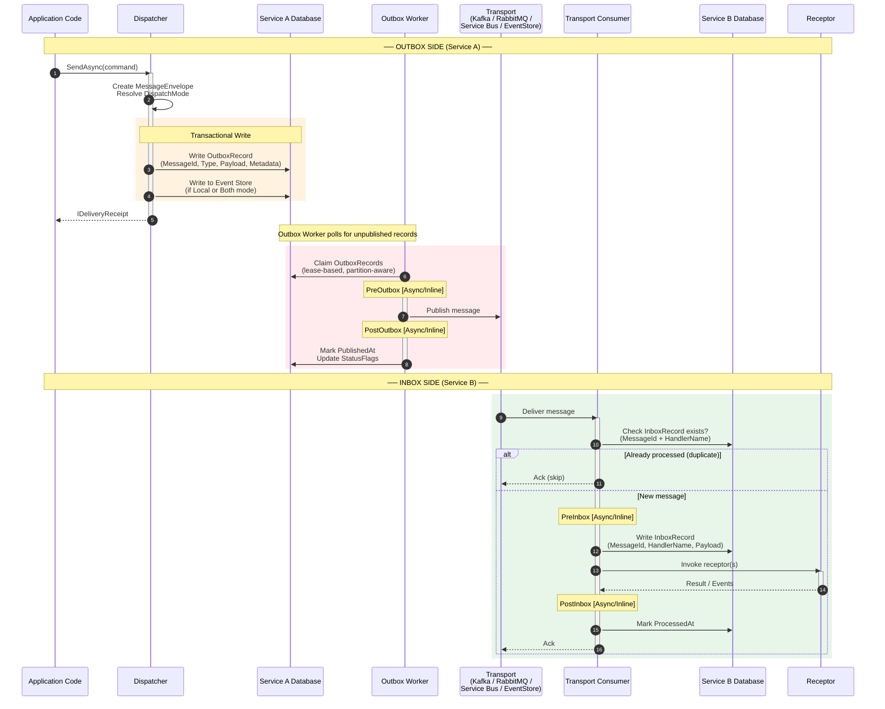
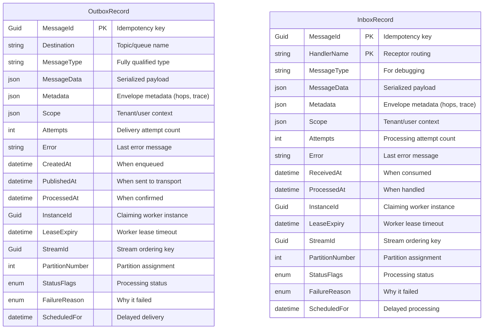

# Inbox / Outbox Pattern

Whizbang implements the transactional outbox and inbox patterns for reliable cross-service messaging. The outbox guarantees **at-least-once delivery**, while the inbox provides **exactly-once processing** through deduplication.



## Outbox Record Structure



## Delivery Guarantees

| Aspect | Outbox (Sender) | Inbox (Receiver) |
|--------|-----------------|------------------|
| **Pattern** | Transactional outbox | Idempotent consumer |
| **Guarantee** | At-least-once delivery | Exactly-once processing |
| **Dedup Key** | MessageId | MessageId + HandlerName |
| **Concurrency** | Lease-based claiming | Lease-based claiming |
| **Ordering** | Stream-aware (Phase 7) | Stream-aware (Phase 7) |
| **Retry** | Automatic with backoff | Automatic with backoff |
| **Dead Letter** | After max attempts | After max attempts |

## Message Source Context

Receptors can inspect `ILifecycleContext.MessageSource` to know how a message arrived:

```
MessageSource.Local   → Dispatched in-process (no outbox/inbox)
MessageSource.Outbox  → Publishing from this service's outbox
MessageSource.Inbox   → Received from external transport
```
