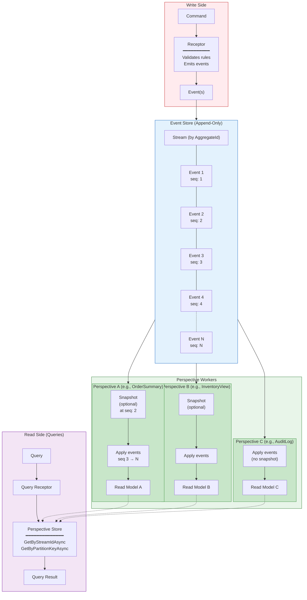
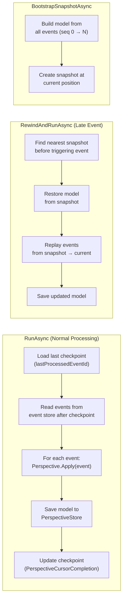
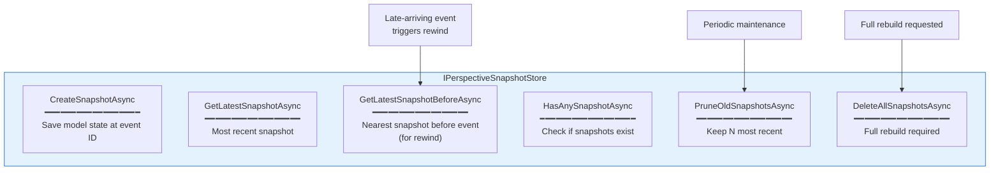

# Event Sourcing & Perspectives

Events are persisted to an append-only event store. **Perspectives** are Whizbang's read model projections — pure functions that transform event streams into queryable state. They support snapshots, replay, and time-travel debugging.



## Perspective Runner Lifecycle



## Snapshot Store Operations



## Perspective Type Declaration

Perspectives declare their model and event types via generic marker interfaces. The source generator scans these to produce compile-time projection code:

```
IPerspectiveBase<TModel>                          → 0 event types (manual)
IPerspectiveBase<TModel, TEvent1>                 → 1 event type
IPerspectiveBase<TModel, TEvent1, TEvent2>        → 2 event types
...
IPerspectiveBase<TModel, T1, T2, ..., T15>        → up to 15 event types
```

## Key Properties

| Property | Description |
|----------|-------------|
| **Pure functions** | `Apply(event)` is deterministic — same events always produce same model |
| **Independently rebuildable** | Each perspective can be rebuilt from event stream without affecting others |
| **Snapshot-optimized** | Long streams use snapshots to avoid replaying from event 0 |
| **Time-travel** | Rewind to any point by replaying events up to that position |
| **Multi-event** | A single perspective can handle up to 15 different event types |
