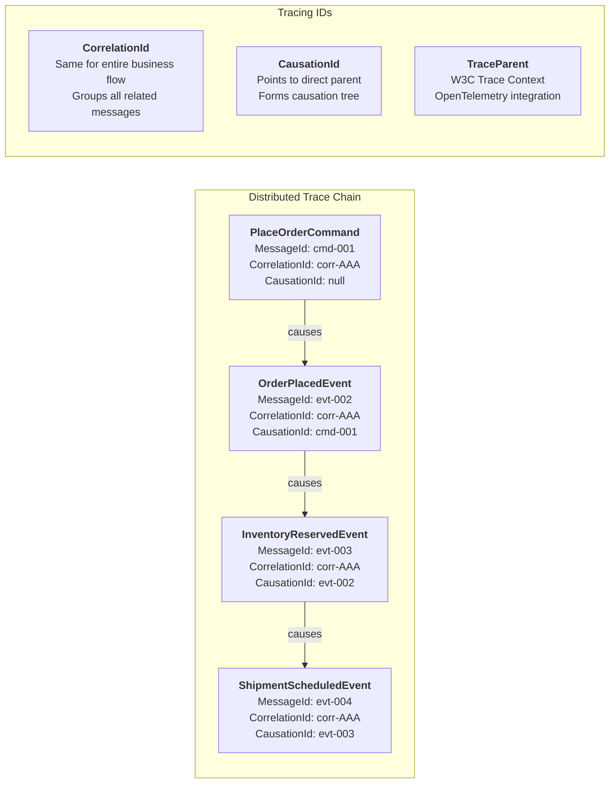
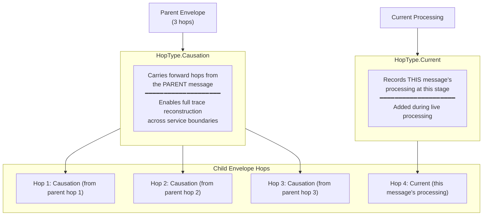
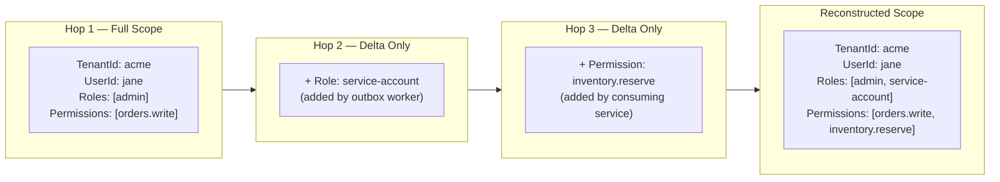

# Message Envelope Journey

```mermaid
flowchart TB
    subgraph Origin["1. Envelope Creation"]
        direction TB
        Create["Dispatcher creates envelope<br/>━━━━━━━━━━━━━━━━━━━━━━<br/>• MessageId (UUIDv7 — time-ordered)<br/>• Payload (strongly typed)<br/>• CallerInfo (source location)<br/>• ScopeContext (auth/tenant)"]
        Register["Register in EnvelopeRegistry<br/>(reference identity lookup)"]
        Create --> Register
    end

    subgraph Hop1["2. First Hop — Dispatcher"]
        direction TB
        H1["MessageHop {<br/>  Type: Current<br/>  ServiceInstance: Order Service<br/>  Topic: 'order-commands'<br/>  StreamId: order-123<br/>  ExecutionStrategy: Async<br/>  Scope: { TenantId: acme, UserId: jane }<br/>  TraceParent: 00-abc...-01<br/>  CallerMemberName: PlaceOrder<br/>  CallerFilePath: OrderController.cs<br/>  CallerLineNumber: 42<br/>}"]
    end

    subgraph Hop2["3. Second Hop — Outbox Worker"]
        direction TB
        H2["MessageHop {<br/>  Type: Current<br/>  ServiceInstance: Order Service (worker)<br/>  Topic: 'order-events'<br/>  PartitionIndex: 3<br/>  SequenceNumber: 1847<br/>  Duration: 12ms<br/>}"]
    end

    subgraph Hop3["4. Third Hop — Transport Consumer"]
        direction TB
        H3["MessageHop {<br/>  Type: Current<br/>  ServiceInstance: Inventory Service<br/>  Topic: 'order-events'<br/>  PartitionIndex: 3<br/>  Scope: (delta — adds ServiceAccount role)<br/>  TraceParent: 00-abc...-02<br/>}"]
    end

    subgraph Hop4["5. Fourth Hop — Perspective Worker"]
        direction TB
        H4["MessageHop {<br/>  Type: Current<br/>  ServiceInstance: Inventory Service<br/>  StreamId: inventory-456<br/>  Duration: 3ms<br/>}"]
    end

    Origin --> Hop1 --> Hop2 --> Hop3 --> Hop4

    style Origin fill:#e3f2fd,stroke:#1565c0
    style Hop1 fill:#fff3e0,stroke:#ef6c00
    style Hop2 fill:#fff3e0,stroke:#ef6c00
    style Hop3 fill:#e8f5e9,stroke:#2e7d32
    style Hop4 fill:#e8f5e9,stroke:#2e7d32
```

Every message in Whizbang is wrapped in a `MessageEnvelope<T>` that tracks its complete journey through the system. Each processing step adds a **hop** to the envelope, creating a full distributed trace with causation chains, security context deltas, and W3C Trace Context propagation.



## Causation & Correlation Chains



## Hop Type: Current vs Causation



## Security Context Propagation (ScopeDelta)

Each hop carries a `ScopeDelta` — a minimal diff of security context changes rather than the full context:



## Envelope Registry

The `IEnvelopeRegistry` enables looking up an envelope when only the message payload is available:

```
Receptor receives: TMessage message
Registry lookup:   EnvelopeRegistry.Get(message) → IMessageEnvelope<TMessage>
Use case:          Event store needs envelope for tracing context on append
```

This is critical for maintaining the tracing chain when receptors interact with the event store using just the message object.

## MessageHop Fields Reference

| Field | Purpose |
|-------|---------|
| `Type` | Current (this processing) or Causation (parent trace) |
| `CausationId` | MessageId of the parent message |
| `CorrelationId` | Shared ID across entire business flow |
| `CausationType` | Type name of the parent message |
| `ServiceInstance` | Service name, ID, host, process ID |
| `Timestamp` | When this hop was recorded |
| `Topic` | Message topic/queue |
| `StreamId` | Event stream identifier |
| `PartitionIndex` | Partition assignment |
| `SequenceNumber` | Position in stream |
| `ExecutionStrategy` | How the receptor was invoked |
| `Scope` | ScopeDelta — security context changes |
| `Metadata` | Custom JSON key-value pairs |
| `Trail` | PolicyDecisionTrail — routing decisions |
| `CallerMemberName` | Source method name |
| `CallerFilePath` | Source file path |
| `CallerLineNumber` | Source line number |
| `Duration` | Processing time for this hop |
| `TraceParent` | W3C Trace Context header |
