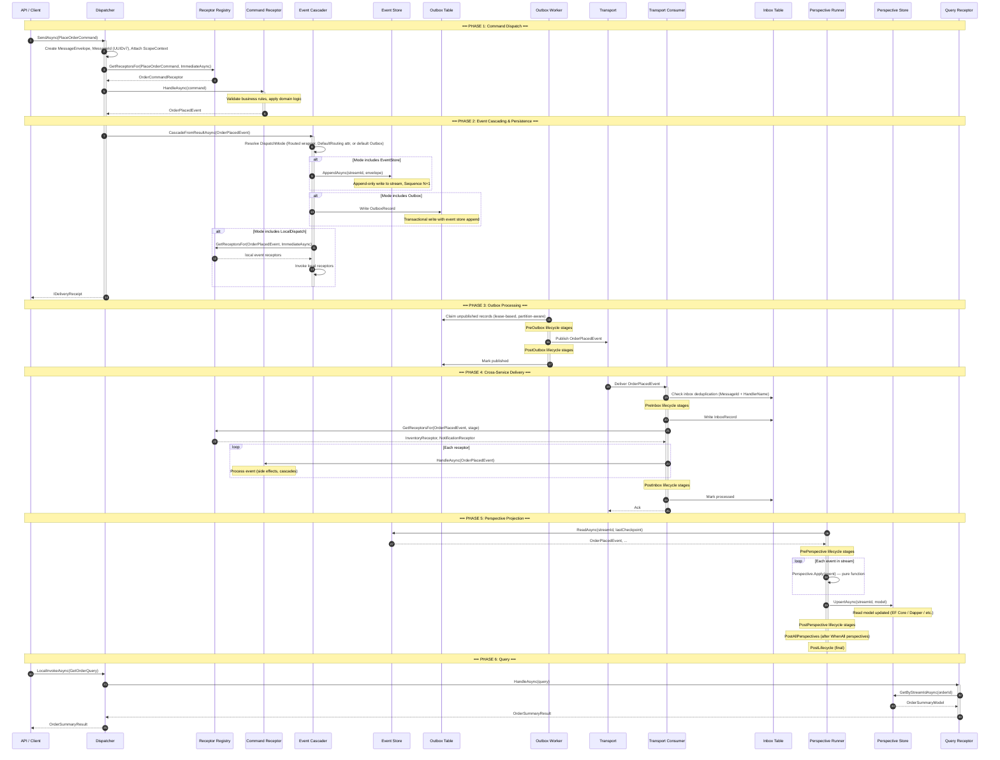
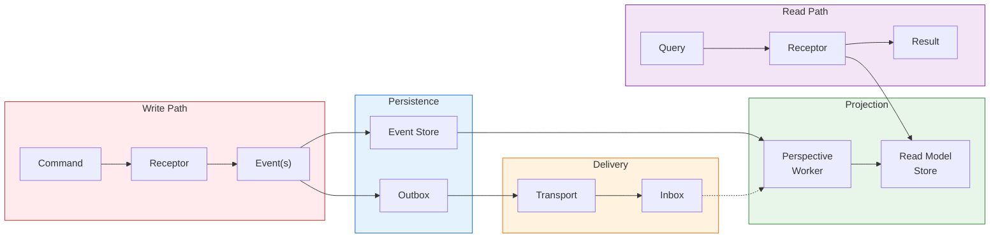
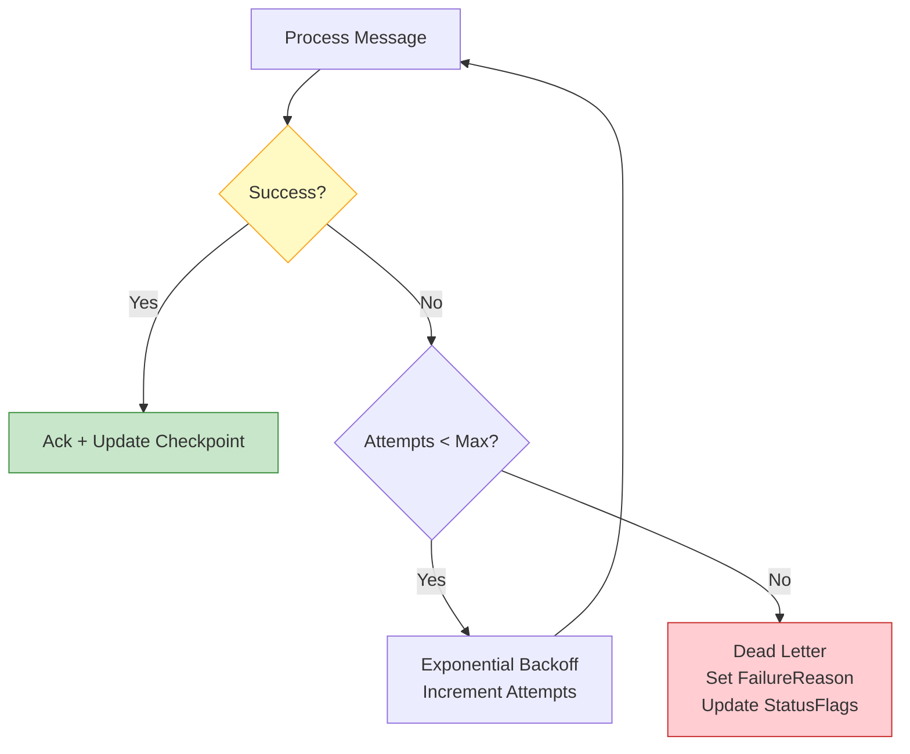

# End-to-End Event Processing Flow

The complete journey of a command through the Whizbang system — from API request to updated read model available for queries.

## Simplified Overview

## Processing Guarantees Summary

| Guarantee | Mechanism |
|-----------|-----------|
| **Commands processed exactly once** | Receptor invocation is synchronous within dispatch |
| **Events persisted durably** | Transactional append to event store |
| **Cross-service at-least-once** | Outbox pattern with transport acknowledgment |
| **Consumer exactly-once** | Inbox deduplication by MessageId + HandlerName |
| **Projections eventually consistent** | Perspective workers poll event store |
| **Ordering within stream** | Stream-aware Phase 7 coordination |
| **Full traceability** | Envelope hops with causation/correlation chains |
| **Replay-safe** | ProcessingMode flag; `[FireDuringReplay]` opt-in |

## Error Handling Flow

